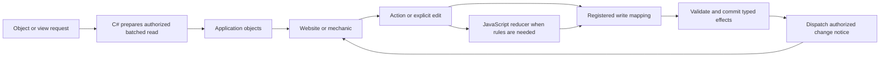

# System audit and cleanup implementation plan

**Audit date:** 6 September 2026. **Source baseline:** `017ed8fec13a54b22b50ef6fa14f04b1cf414c09`.

**Plan updated:** 6 September 2026, following the user's requests to integrate registered application objects, efficient C# mappings, JavaScript reducers and change broadcasting, then make the cleanup one ordered queue executable without further confirmation.

**Purpose:** preserve the audit evidence and provide one coordinated implementation plan. The user has authorized unattended implementation under the contract below, including the scoped decisions needed to finish each slice. This planning edit does not itself start implementation or change live game state. Current execution status belongs to each slice in the single ordered list.

## Queue and unattended execution contract

The user requested on 6 September 2026: "one slice list in the correct order" so they can queue "Implement slice x from /C:/Users/dante/source/repos/DantesRoleplay/docs/current/SYSTEM-AUDIT.md" and have it done "without me having to confirm anything" while away. This is explicit authorization for the scoped work below. The matching exception in [AGENTS.md](../../AGENTS.md) makes this instruction available to future runs.

Queue slices **0 through 17**, in numerical order, in the same task and checkout. There is one authoritative [ordered slice list](#ordered-slice-list); its existing SC00–SC17 identifiers are aliases, not a second sequence. For example:

```text
Implement slice 0 from /C:/Users/dante/source/repos/DantesRoleplay/docs/current/SYSTEM-AUDIT.md
```

Replace `0` with the next number. `slice 0`, `slice 00` and `SC00` identify the same slice. The optional leading slash in `/C:/...` is queue notation; the Windows file is `C:/Users/dante/source/repos/DantesRoleplay/docs/current/SYSTEM-AUDIT.md`. Preparing this document does not create scheduled jobs or start the implementation queue.

**Execution:** implement the requested slice through its exit checks and receipt commit; do not stop after proposing a design or asking for approval. Read AGENTS.md, the current entry guide and this document, then only the exact owners/contracts/tests needed. Reuse completed work. If earlier slices are unfinished, resume the earliest unfinished predecessor and proceed through the requested number, with a separate commit per completed slice. Do not start a later slice merely because it was queued while an earlier one was running or blocked. A repeated request for a completed slice verifies its recorded result against current source and resumes only missing or regressed work. This sequence is serial; do not run these migrations concurrently in separate tasks or checkouts.

**Delegated decisions and confirmation:** choose and document the exact names/IDs, compatible schema and public-contract versions, mapping declarations, library integration, implementation details and cross-owner changes required by this plan. The user also authorizes the plan's evidence-backed source removals, data-preserving migrations, local catalog activation, local website publication, necessary local service restarts and completed-feature acceptance once the stated checks pass. Do not seek another confirmation for these scoped actions. In this document, "reviewed", "agreed", "approved" and "acceptance" mean agent review plus the specified evidence under this authorization; they do not create a new human checkpoint. Record important decisions and their reasons in the owning slice and commit, without creating another implementation plan.

**Preservation and cutover:** the authorization does not relax C#/JavaScript ownership, audience permissions, compatibility, transaction or recovery invariants. Before a live change, identify the actual listener/content root/database and binding, preserve a consistent database/blob backup and affected live-authored exports, and rehearse the exact change on an isolated copy. Review the exact diff and dry-run output, then use the established migration/activation/publication path at a recorded synchronization boundary. Coordinate writers during a data-changing cutover; never restore a backup over newer legitimate commits. Perform readiness and exact readback checks; recover the last verified compatible runtime if they fail, preserving committed data. Source cleanup requires consumer/history checks and a precise removal list. Never drop campaign/history data, overwrite unrelated work, rewrite Git history, change access grants, or bulk-delete retained identities to finish a slice. No remote push or unrelated external publication is included. Exercise gameplay writes against disposable data; live verification must preserve actual campaign content.

**Blockers while away:** make reasonable decisions and fix ordinary failures autonomously. Do not ask questions or wait for a reply. If required evidence, a dependency, access, a recovery guarantee or an external execution permission cannot be obtained, finish the independent safe work within the slice, preserve the working system and mark that slice **Blocked** with the exact cause and remaining work. A later queued request may retry the blocked predecessor when conditions change; it must not skip it or repeat an unchanged failed operation indefinitely. Do not bypass tool approval controls. Required architecture or failing correctness/performance checks cannot be relabeled as optional. A candidate optimization or retirement may be deliberately retained when measurements or compatibility evidence justify it, with the reason recorded; that does not excuse an unfinished required feature.

**Completion and receipts:** each slice below owns its status. Use **Not started**, **In progress**, **Complete**, or **Blocked**, followed by a compact outcome with verification results, evidence locations, retained candidates and limitations. Update that entry in the slice commit; detailed history stays in Git and ignored evidence. Run focused tests while iterating, catalog validation after catalog changes, the full suite for feature acceptance, and the protocol walk when MCP contracts or dependency registration change. Verify the actual served browser path for delivered UI behavior. Commit only reviewed slice changes with a receipt stating what changed, what ran/passed/failed and what remains. Do not mark a slice complete on focused tests when its required full or served-runtime checks have not passed. If committing is unavailable, preserve verified work and report that limitation. Final closeout requires every slice's mandatory exit conditions; an unresolved blocker keeps the document open.

## What deserves attention first

The largest confirmed user-facing cost is loading the connected D&D hub. Two ordinary DM loads made **2,096 HTTP requests each** and took **12.48 and 13.00 seconds**. The knowledge endpoint accounted for **9.39 and 9.45 seconds** of those loads. These measurements use the production loader against the running local server, rather than a simulated response fixture.

The clearest repository cleanup is **678 tracked build-output files occupying 261.00 MiB** in five old verification directories. These include obsolete assembly copies and third-party binaries. The clearest runtime storage opportunity is repeated web assets: **591 stored asset rows contain 184.13 MiB of bytes, while their 179 distinct content hashes represent 26.51 MiB**. The remaining **157.62 MiB** is repeated payload by stored hash. A storage redesign could preserve every page revision while sharing identical bytes; deleting revision history is a separate decision.

There are also real sources of future regressions: unconsumed pagination cursors, three copies of the item response-envelope checks, excluded former-host sources and tests, and large mixed-purpose files. Some apparent duplication is deliberate: 86 compatibility catalog records have explicit retention requirements, and several large frontend modules are still used by tests.

The implementation approach is to replace repeated application-side ECS assembly with **registered application object contracts**, executed by a generic C# mapping engine. Catalog JavaScript will retain game behavior through pure reducer-style mechanics. Validated changes will use the existing transaction/effect path, followed by authorized object/view notifications. Each replacement will retire its superseded loading or mapping code as part of the same cleanup program. The original 23 findings and measured baseline below remain unchanged; the ordered slices 0–17 (SC00–SC17) supersede the earlier suggested A–K sequence.

For implementation, follow [the unattended execution contract](#queue-and-unattended-execution-contract), [the target design](#target-design-registered-objects-and-controlled-state-changes) and the requested entry in [the ordered slice list](#ordered-slice-list). Consult the finding details for evidence and retirement constraints.

## Scope and evidence standard

The pass inventoried **6,272 tracked files** within the allowed scope, including binaries and authored assets by metadata. It mechanically scanned **1,060 code/style/script files, approximately 206,800 lines**, excluding migration-generated code, generated runtime validators, and build directories from the code comparison. It inspected project configuration, registration, ownership, reference paths, pagination, caching, request orchestration, persistence, validation, AI scheduling, and release checks. The solution has seven C# projects and one game-content project; `src/system` has 46 capability directories.

This was a broad inventory with targeted source inspection, not a manual review of every line. Exact-file comparison normalized line endings; the additional duplicate-block screen compared whitespace-normalized 40-line windows at 10-line intervals. Neither method proves that all semantic duplication has been found. Frontend reachability was checked from `src/server-host/main.tsx` through literal static and dynamic imports, then candidate names were searched independently. Reflection, runtime registrations, historical migrations, and database-held references need separate retirement proof.

Excluded: `_to_delete/`, world-building documents/media under `docs/world/`, rulebook references under `docs/pdfs/`, prior generated evidence, dependency caches, and unrelated private configuration. Public/source asset filenames and sizes were inventoried; artwork was not evaluated. Historical Word plans were identified by path only and were not reopened. No network load test, external package-advisory search, heap dump, CPU profile, full test suite, or full catalog validation was performed. Package versions have not been classified as obsolete merely because a newer release might exist.

Evidence labels:

- **Measured:** reproduced or counted in this pass. Timing observations are samples, not percentiles.
- **Static:** supported by source, references, or evaluated build configuration. Runtime impact may still need measurement.
- **Candidate:** a plausible improvement requiring ownership or profiling evidence before a fix.
- **Retained:** an intentional compatibility, test, recovery, or audit boundary; not deletion-ready.

Priority means suggested order of investigation: **P1** affects current usability or completeness; **P2** warrants planned engineering; **P3** is maintenance after higher-impact work. Finding labels are document references, not new runtime IDs. Every finding below starts **Open for study**, except entries explicitly classified as retained.

## Findings register

| ID | Priority | Category | Finding | Evidence |
| --- | --- | --- | --- | --- |
| P01 | P1 | Performance | Hub bootstrap loads whole-world detail before the selected view is ready | Measured + static |
| P02 | P1 | Performance | Knowledge builds the whole projection, then hydrates selected records again | Measured endpoint; static cause |
| P03 | P2 | Performance | Chronology scans every entity for a component | Measured endpoint; static cause |
| P04 | P2 | Performance | Active catalog materialization rereads and parses source per service scope | Static |
| P05 | P2 | Performance | Role-constraint checks load complete schema history and constrained state | Static |
| P06 | P2 | Performance | Schema compilation and same-schema validation have serialization points | Candidate; bounded cache confirmed |
| P07 | P2 | Performance | Play-record writes share one synchronous process-wide gate | Static |
| P08 | P2 | Performance | Scheduled AI jobs run serially within each polling batch | Static |
| P09 | P2 | Storage | Page revisions repeat identical asset bytes | Measured |
| P10 | P2 | Storage | Activation document evidence and indexes are a major growing allocation | Measured; redesign candidate |
| P11 | P2 | Performance assurance | Initial-JavaScript budget excludes the time and requests needed for a usable hub | Static + measured |
| P12 | P3 | Redundancy/performance | Location cache cannot reuse data across ordinary hub reloads | Static + measured repeated traffic |
| C01 | P1 | Completeness | Some directory/relationship reads ignore continuation cursors | Static |
| O01 | P2 | Obsolete outputs | Old build directories and binaries remain tracked | Measured + static |
| O02 | P2 | Obsolete source | Fourteen source/test files are deliberately excluded from compilation | Evaluated build + static |
| O03 | P3 | Obsolete UI | Two unreferenced frontend components retain matching CSS | Static |
| O04 | P3 | Asset ownership | Fixture assets and other source media need an owner/retirement inventory | Static; candidate |
| O05 | P2 | Obsolete data candidate | A second tracked database can be mistaken for the live store | Measured + static; candidate |
| O06 | P3 | Obsolete documentation | Entry-page status is dated and does not describe this checkout | Static |
| R01 | P3 | Retained redundancy | Fifteen old mechanic path pairs remain alongside the application catalog | Static; retained |
| R02 | P3 | Test organization | Fixture world/projection code lives under the production source directory | Static; retained by tests |
| R03 | P2 | Redundancy | Item clients repeat envelope and request-validation logic | Static |
| R04 | P3 | Maintainability | Several files combine many owners and change paths | Measured size; refactoring candidate |

## Performance and storage findings

### P01 — Whole-world work blocks hub bootstrap

**Owner:** D&D web loader and generic web read surfaces.

**Evidence:** `src/system/web-interface/dnd2024/src/server-host/main.tsx:52` calls `readGameServerContext` before projecting the ready hub. In `src/server/game-server-context.js:2353`, bootstrap waits for knowledge and chronology together with campaign state; at `2461` it loads the location directory and campaign structure; at `2498` it also loads the DM world directory. `readRawLocationDirectory` at `1133` lists all entities and makes four requests per location. `readWorldDirectory` at `1913` adds containment, people, and faction reads. Paths in this paragraph after the first full path are relative to the same web project.

The measured DM request breakdown was 27 entity-list, 782 component, 583 media, 518 containment, 180 relationship, and six other requests. It delivered 259 locations, 124 people, and 35 factions even with character details deferred. The existing eight-request concurrency limit worked: peak concurrency was eight. It limits pressure but does not reduce total work.

**Impact:** all these reads delay the initial usable hub and are repeated for a refresh or perspective reload. Increasing concurrency or rate limits alone would transfer more pressure to the server.

**Later pass:** load the minimum authorized campaign shell first; request world subsections when opened. Investigate a generic, audience-bound batched directory/component/media projection, reusing existing ECS search and media facilities where their contracts fit. Keep C# generic and let catalog declarations select game-specific meaning.

**Acceptance:** compare the same DM and actor workflows at the same database revision; measure request counts, first usable view, bytes, cancellation, and freshness. Require complete faction/location results, no hidden-content exposure, and preserved existing-view behavior on failure. Establish an agreed latency/request budget before implementation; this audit does not invent an accepted production SLA.

### P02 — Knowledge projection and hydration repeat substantial work

**Owner:** authorized knowledge notebook and canonical source.

**Evidence:** `DantesRoleplay.Web/Http/WebInterfaceEndpoints.cs:1122` calls the notebook reader. `src/system/knowledge/persistence/ApplicationKnowledgeCanonicalSource.cs:87` pages through every entity; `ProjectAsync` at `129` reads each candidate's component pages before knowing whether it is a knowledge record. `ReadDocumentAsync` at `111` reloads the state-space relationships for each document. `AuthorizedKnowledgeNotebookReader.cs:95` then hydrates every selected document and, for actors, rechecks effective knowledge individually. `ApplicationKnowledgeEffectiveStateResolver.cs:26` loads relationships and containments and computes graph evidence on each invocation.

The knowledge HTTP response took **9,391.70 ms** and **9,450.88 ms** in the two DM samples and contained **214,318 bytes** each time. This is measured endpoint latency; the share attributable to individual SQL statements or hashing has not been profiled. The notebook limit applies after world projection, so it does not bound discovery cost.

**Later pass:** preselect records by the declared component types; index relationships once per read; hydrate and revalidate selected records in a bounded batch or consistent read snapshot. Preserve the actor-state, source-revision, world, participation, and familiar/unknown disclosure checks. Simply removing the second validation would weaken the existing boundary.

**Acceptance:** SQL-command counts and allocation measurements at increasing entity/knowledge sizes; stale-state and cross-actor tests; same authorized output and revisions; repeat live timing under both GM and actual actor seats. The Player preview measurement below does not establish actor notebook performance.

### P03 — Chronology performs a full entity scan

**Owner:** chronology projection endpoint.

**Evidence:** `DantesRoleplay.MCPServer/WorldChronologyWebEndpoint.cs:115` loads graph edges; at `146` it pages every entity and at `153` asks for the chronology component on each. It stops at 10,000 entities. The two DM endpoint samples took **962.03 ms** and **856.09 ms**, with **234,374 response bytes**.

**Later pass:** investigate declared component-type discovery using the existing generic search store, then fetch the required graph evidence in a batch. Consider cursor-based chronology delivery if users do not need every event immediately. A change to the public response requires its own reviewed contract.

**Acceptance:** identical calendar, visibility, world-membership and subject filtering; ordering and completeness at the scan boundary; increasing unrelated catalog entities should not proportionally increase chronology component lookups.

### P04 — Catalog materialization repeats filesystem and parsing work

**Owner:** activated catalog navigation.

**Evidence:** `src/system/catalog-navigation/persistence/ActivatedApplicationCatalogProvider.cs:36` builds a snapshot by enumerating active winners, checking source registrations, reading text, and parsing records. `ReadText` at `230` reads and hashes file bytes. The provider's cache at `340` is instance-local; `src/system/catalog-navigation/hosting/CatalogNavigationComponentRegistration.cs:16` registers the materializer and provider as scoped services. Thus a new request scope starts without the prior scope's materialized snapshot. `src/system/application-activation/persistence/ActivatedApplicationDocumentReader.cs:51` independently reads/hashes exact active documents.

**Impact:** a candidate source of repeated disk I/O, parsing, allocation and hashing for catalog/read-model traffic. No causal timing or cache-hit rate was measured here.

**Later pass:** instrument materialization count, file bytes and elapsed time per request. Design shared immutable caching only if invalidation still catches source-file drift, source-registration changes, activation changes and allowed-root changes. Keying solely on activation revision would not preserve the current file-drift check.

**Acceptance:** warm-request allocation/I/O reduction, bounded retention, and existing file-drift/activation tests. Do not turn a scoped provider into an unbounded singleton or share request-specific authorization state.

### P05 — Role constraints have a whole-state validation cost

**Owner:** generic ECS writes and role constraints.

**Evidence:** `DantesRoleplay.DataAccess/Ecs/SqliteEcsRoleConstraintValidator.cs:24` loads eligible type IDs and all their schema versions, parses policies, and, when constraints apply, loads all enabled entities and all state-space components before validating. This is a correctness boundary inside the write transaction, not accidental dead code.

**Later pass:** measure write duration and SQL/allocation counts with 1,000, 10,000 and larger entity sets. Consider caching immutable parsed policies separately from mutable state, and validating affected constraint sets with complete indexes. Keep cross-entity uniqueness/cardinality checks transactionally complete.

**Acceptance:** concurrent-write, enable/disable, uniqueness and multi-effect tests must still assert the same invariants. No live write workload was generated in this audit, and no observed slow write is claimed.

### P06 — Schema validation has explicit lock contention candidates

**Owner:** bounded schema validator.

**Evidence:** `src/system/schema-validation/persistence/BoundedJsonSchemaValidator.cs:45` holds the cache lock while compiling a miss. At `182`, evaluations sharing a retained schema serialize on that schema object. Registration is singleton in `hosting/SchemaValidationComponentRegistration.cs:10`.

**Existing protection:** retention is bounded to 256 schemas, 2 MiB of accounted text and 32,000 nodes; compilation uses a dedicated schema registry. This pass found no basis to repeat an old claim of an unbounded schema cache or a proven memory leak.

**Later pass:** profile lock-wait time under mixed schema misses and concurrent same-schema validation. Assess per-key compilation coordination or safe evaluator instances only after establishing the library's thread-safety requirements.

**Acceptance:** schema equivalence, resource limits, malformed-input handling, bounded cache eviction and concurrent correctness; measured improvement rather than removal of safety locks on speculation.

### P07 — Play recording synchronizes every conversation write

**Owner:** durable play recording.

**Evidence:** `src/system/play-recording/persistence/ApplicationPlayRecordStore.cs:13` declares a static `SemaphoreSlim(1,1)`. `ResumeOrCreate`, `AppendMessage`, `AppendNarrative`, and other writes call synchronous `Wait()` and synchronous database operations; the gate is shared across store instances and conversations.

**Impact:** potential head-of-line blocking and blocked request threads when several conversations write. SQLite's own single-writer behavior remains relevant; removing this gate is not automatically a throughput improvement.

**Later pass:** measure waiting and transaction duration on a disposable database with concurrent conversations. Evaluate asynchronous waiting and narrower synchronization while preserving conversation creation uniqueness, ordered messages, revision checks and atomic narrative/truth commits.

**Acceptance:** concurrency and idempotency tests plus latency/queue measurements. No live conversations were written during the audit.

### P08 — Scheduled AI batches are serial

**Owner:** scheduled AI task worker.

**Evidence:** `src/system/trigger-scheduling/hosting/ScheduledAiTaskTools.cs:158` polls every two seconds; `RunBatchAsync` at `180` selects at most eight unread notifications and awaits each AI task before processing the next. A slow provider response can delay later jobs and the next poll. The outer polling catch is silent, although per-job failures are audited inside the batch.

**Later pass:** add queue age, provider duration and worker-failure visibility before deciding on bounded parallelism or per-provider isolation. Review claiming/recovery separately from scheduling throughput; this pass did not test crash recovery or claim lost jobs.

**Acceptance:** bounded provider concurrency, deterministic claims and idempotent processing, cancellation, audit evidence, and continued absence of self-approved model writes. Provider calls were not exercised by this audit.

### P09 — Identical page assets are stored repeatedly

**Owner:** web-content storage and revision lifecycle.

**Evidence:** `DantesRoleplay.Web/Storage/WebPageStore.cs:427` creates new asset rows carrying full bytes for each page revision. `WebContentDbContext.cs:55` makes revision/path unique; content hash is recorded but is not a shared byte-store key. Read-only SQLite aggregation found 591 rows, 179 unique hashes, 193,073,083 total payload bytes, and 27,800,180 bytes when grouped by hash. Ninety-five hash groups repeat; 412 additional rows account for 165,272,903 repeated bytes.

**Later pass:** design shared immutable asset storage referenced by revision/path. Preserve asset media types, immutable URLs, private cache policy, exact hash verification, rollback and old-page resolution. Compare with the existing blob subsystem, but its accepted media types and authorization contract do not automatically fit arbitrary HTML/JS/CSS assets.

**Acceptance:** all retained page revisions read back byte-for-byte, backups restore, and signed release verification passes. The 157.62 MiB estimate is repeated payload, not promised filesystem recovery: indexes, SQLite free pages, WAL and a migration strategy affect actual size. This is a migration candidate, not approval to delete history.

### P10 — Activation history has significant metadata/index growth

**Owner:** application activation persistence.

**Evidence:** the live `system_application_activation_document` table contains **159,426 rows**. SQLite `dbstat` attributes **53,911,552 bytes** to the table, **21,835,776 bytes** to its logical-identity index, and **3,801,088 bytes** to its primary-key index: **75.86 MiB combined**. Mapping starts at `DantesRoleplay.DataAccess/DantesRoleplayDbContext.cs:740`; each activation retains its own document evidence.

**Later pass:** measure growth per activation and lookup plans. Study deduplicated immutable manifest records, compact identity keys, or reviewed archival policy. This evidence supports historical resolution and recovery; similar rows across revisions are not automatically obsolete.

**Acceptance:** exact activation fingerprints, winner ordering, rollback, source-drift detection and historical operation resolution remain valid. No activation records were changed or a migration drafted here.

### P11 — The current budget does not measure a usable page

**Owner:** web performance checks and release verification.

**Evidence:** `src/system/web-interface/dnd2024/vite.server.config.ts:16` enforces a 90,000-byte gzip initial-JavaScript limit. `scripts/bundle-budget.mjs:5` follows static chunk imports only. `src/server-host/main.tsx:57` dynamically imports the data loader and connected-envelope projector before a ready view; the hub is also lazy. These are required for normal use despite being outside the initial chunk graph. The measured network work in P01 can therefore coexist with a passing bundle budget.

**Later pass:** keep the initial budget, add first-ready-view dependency accounting and a read-only end-to-end request/latency regression check. Measure CSS, mandatory lazy chunks, JSON, and browser parse/render time separately. Existing performance marks are useful but `src/observability/performance.js:11` records each mark only once per page lifetime, so repeated switches need interaction-scoped measurements.

**Acceptance:** deliberately delayed knowledge and excessive-request fixtures fail the new gate; normal actor and DM flows pass an agreed budget. Do not label all lazy loading or generated validators as waste: they serve real feature and validation boundaries.

### P12 — The location cache has a narrower lifetime than its TTL suggests

**Owner:** D&D hub loader.

**Evidence:** `src/system/web-interface/dnd2024/src/server/game-server-context.js:1259` uses a WeakMap keyed by `options.fetchImpl`. `readGameServerContext` at `2261` creates a fresh `createHubReadScope` and `scope.fetch` for each load. Ordinary subsequent loads therefore use another cache key even within the ten-second TTL. Both measured DM loads made the same 2,096 requests. The listing cache inside `hub-read-scope.js` correctly reused 27 list pages within a load.

**Later pass:** either describe/implement this as a within-load memoization or establish a deliberately bounded cross-load cache. Any broader reuse must bind principal, audience, campaign, source revision and invalidation; the current narrow scope protects against cross-view disclosure.

**Acceptance:** prove reuse where intended, eviction and cancellation, and immediate retirement on audience or source changes. Treat this as overlap with P01, not a separate promise of another full request-count reduction.

## Completeness and obsolete-file findings

### C01 — Pagination remains incomplete in adjacent loaders

**Owner:** D&D world and campaign loaders.

**Evidence:** `src/system/web-interface/dnd2024/src/server/game-server-context.js:1970` requests one containment page per location with `limit=100` and does not consume `nextCursor`. Faction relationships at `2039` similarly pass one page to `relationshipTargetIds` at `1297`, which only processes `items`. `readCampaignStructure` at `2081` stops when its candidate map reaches 100. `readRawLocationDirectory` at `1133` breaks on malformed/failed pages and treats repeated cursors as completion; the outer scope catches some transport failures, but not every malformed-success case.

**Impact:** a location with more than 100 contained records, a faction with more than 100 links of one kind, or a sufficiently large campaign can silently present an incomplete result. The faction fix at the baseline commit repairs the entity-discovery cutoff; it does not repair these separate loops. No missing live records from these remaining boundaries were demonstrated in this audit.

**Later pass:** inventory every list-consuming helper, consume bounded advancing cursors, or propagate explicit partial/unavailable state. Avoid converting malformed data into a credible empty list.

**Acceptance:** focused fixtures at 99/100/101 records, repeated cursors, oversized pages, malformed JSON, and failures after a valid first page; verify no partial result is presented as complete. Keep this distinct from a performance-only batching change.

### O01 — Tracked build output is the largest clear repository cleanup

**Owner:** solution maintenance and repository hygiene.

| Tracked directory | Files | Bytes | Approx. MiB |
| --- | ---: | ---: | ---: |
| `DantesRoleplay.Tests/.codex-build/` | 139 | 58,417,027 | 55.71 |
| `DantesRoleplay.Tests/.codex-obj/` | 8 | 554,130 | 0.53 |
| `DantesRoleplay.Tests/bin-slice2/` | 470 | 168,801,714 | 160.98 |
| `DantesRoleplay.Tools/.codex-build/` | 53 | 45,612,166 | 43.50 |
| `DantesRoleplay.Tools/.codex-obj/` | 8 | 296,186 | 0.28 |
| **Total** | **678** | **273,681,223** | **261.00** |

These are tracked files, not just ignored local disk usage. Examples include `DantesRoleplay.RuleAccess.dll`, old MCP executables, test-platform assemblies and native SQLite runtimes. `Directory.Build.targets:5` already excludes `.codex-build` and `.codex-obj` from source/resource inputs. The solution has no RuleAccess project. Existing ordinary `bin/` and `obj/` ignore patterns do not cover every alternate output directory, and ignores alone do not untrack files.

**Later pass:** verify no supported launcher or recovery procedure depends on these exact paths, retain any necessary evidence outside the source tree, remove reviewed outputs from tracking, and add precise ignore rules. Build from source in a fresh checkout before accepting removal. Removing tracked files from the current revision does not reclaim old Git-history size; history rewriting is a separate, unapproved operation.

### O02 — Former-host sources and tests remain outside the build

**Owner:** MCP composition, main test assembly, former game adapters.

`DantesRoleplay.MCPServer/DantesRoleplay.MCPServer.csproj:25` explicitly excludes:

- `DevelopmentKnowledgeAudience.cs`
- `KnowledgeBackgroundWorker.cs`
- `StoryPlanWorker.cs`

`DantesRoleplay.Tests/DantesRoleplay.Tests.csproj:62` unconditionally excludes these nine files in that project directory:

- `DevelopmentKnowledgeAudienceTests.cs`
- `CatalogWorldFeature7Tests.cs`
- `CatalogWorldFeature9Tests.cs`
- `CategoryToolTests.cs`
- `InformationTests.cs`
- `ProcedureBoundActionVerifierTests.cs`
- `SessionFeature4Tests.cs`
- `SqliteVecExtensionProbeTests.cs`
- `VerbToolTests.cs`

It also excludes `src/system/events-and-notifications/tests/SubscriptionStoreTests.cs` and `src/system/snapshots/tests/SnapshotFeature1Tests.cs`. These **14 files** exist but do not run in the normal build/test configuration. Fresh MSBuild evaluation produced 61 server compile items and 171 test compile items; those counts are files, not test cases.

**Separate intentional exception:** `DantesRoleplay.Tests/ProtocolWalkTests.cs` is opt-in through `IncludeProtocolWalkTests=true`. Its normal exclusion is not evidence of obsolescence.

**Later pass:** classify each excluded file as superseded, behavior still needing migration, or an explicit retained compatibility specimen. Map its assertions to current owners before deletion. Do not re-enable them as a group: their old dependencies and contracts were intentionally removed from the generic host.

**Acceptance:** a file-by-file disposition with replacement test names; current behavior remains covered and no supported feature is inferred from a source file that never compiles.

### O03 — Two unreferenced UI components and their CSS

**Owner:** D&D web presentation.

Candidates: `src/system/web-interface/dnd2024/src/components/HubUnavailable.tsx` (16 lines) and `ServerCampaignConnected.tsx` (76 lines). Neither appears in the production import graph or another source/test reference; independent name searches found their definitions only. Their `.hub-unavailable` and `.server-campaign` styles remain at `src/styles.css:466` onward. The current entry point uses `BootstrapShell`, `RulesOnlyHub` and `DndInformationHub`.

**Later pass:** verify no external fixture imports them, then remove or relocate them and only their unused selectors. These are strong source-removal candidates, but their unreachability already keeps their component JavaScript out of the production module graph.

**Acceptance:** typecheck, mounted unavailable/connected states, build, and CSS selector/reference check. Do not claim a large runtime performance gain from deleting 92 unreachable lines.

### O04 — Media and fixture assets need explicit ownership

**Owner:** web fixtures, authored media, publication tooling.

The D&D web `public/` directory has **38 tracked files totaling 14,635,427 bytes (13.96 MiB)**. `vite.server.config.ts:12` sets `publicDir: false`, so they are not copied wholesale into the server build. Several filenames are still referenced by the fixture world (`src/server/hub-source.js`) and fixture tests. Treat the group as fixture/source assets, not automatically dead runtime assets.

Additional tracked source media exists under `DantesRoleplay.Web/BrowserComponents/MapImages/` and `BrowserComponents/Media/`, including both `caldris-eredane.png` and `caldris-eredane-v2.png`. No reference to the searched path names was found in the inspected code/catalog text. This does **not** exclude database-held, historical-page, external tooling, or excluded world-workspace references. Content similarity and live blob provenance were not compared.

**Later pass:** create a source-asset inventory with fixture, live publication, immutable blob, and historical reference owners. Relocate fixture-only assets if helpful; retire versions only after that inventory proves they are unused. Do not delete an image because its name has a version suffix.

**Acceptance:** reproducible fixture/browser tests, asset-hash and page readback, and no broken live or historical image URL.

### O05 — A second tracked database has an unclear purpose

**Owner:** runtime startup, development setup and catalog tooling.

`data/dantesroleplay.db` is tracked and **2,150,400 bytes**. Read-only inspection found 134 tables, zero operations and zero web pages. The current server uses the separate `DantesRoleplay.MCPServer/data/dantesroleplay.db`, which had 143 tables, 5,772 operations and three web pages at inspection. The stores are not interchangeable copies.

`DantesRoleplay.MCPServer/Program.cs:22` defaults the database below the content root. `run-mcp-server.ps1` supplies the MCPServer working directory; tooling help also points to the MCP server database. The root database has not been proved to be an intentionally maintained seed, and no supported consumer was established during this pass.

**Later pass:** identify its creation/consumer history and either document an explicit seed contract or retire it. Make database selection visible in startup diagnostics and verify launch behavior from different working directories. Do not import, overwrite, or merge these databases based on filename similarity.

**Acceptance:** fresh setup remains reproducible, the intended runtime binding is unchanged, and any retained seed has an owner and refresh policy.

### O06 — Dated entry status can mislead future work

**Owner:** current documentation.

`docs/current/README.md` says its status was last checked on **2026-08-31**, lists 438 catalog records and mentions old full-suite acceptance failures. Those are explicitly dated claims; this audit did not run current catalog validation or the full suite and therefore does not replace them with guessed numbers. The same entry point now routes to the completed item dossier, so the historical status block is easy to confuse with the present state.

**Later pass:** either refresh the status from a defined current verification run or remove volatile counters from the entry guide and keep results in a dated verification record. Old Word plans outside `docs/current/` were not assessed and should not be deleted based on this finding.

**Acceptance:** the entry guide clearly distinguishes current invariants from dated verification results and still routes readers to one relevant topic.

## Redundancy and maintainability findings

### R01 — Retained duplicate mechanics require governed retirement

**Owner:** catalog maintenance and compatibility persistence.

There are **15 paired JavaScript paths** under `catalog/mechanics/dnd2024/mechanic/` and `catalog/mechanics/mechanic/dnd2024/`. Their suffixes are:

`armor-class/write`, `character-level/record`, `check/ability`, `dice`, `encounter-initiative-order`, `hit-points/write`, `initiative/roll`, `saving-throw-proficiencies/record`, `saving-throw`, `skill-proficiencies/record`, `weapon-attack`, `weapon-damage/apply`, `weapon-damage/roll`, `weapon-proficiencies/write`, and `weapon-profile/write`.

The two `dice.js` files are identical after line-ending normalization. The block comparison also found shared code in armor-class, initiative ordering, hit-points, skills and weapon-attack files. The application catalog is a further, current authored owner; similar code does not make historical qualified identities interchangeable.

`catalog/compatibility-retention.json` enumerates **86 retained records** and explicitly classifies them as migration-only. `src/system/catalog/persistence/CatalogCompatibilityRetention.cs:54` fails validation for unexpected additions or missing retained identities. `DantesRoleplay/DantesRoleplay.csproj` excludes the legacy D&D mechanic trees and the lock-picking rehearsal from generic bootstrap resources.

**Disposition:** retained redundancy, not deletion-ready. Follow the manifest's retirement condition: reviewed live export, reference/history/source dependency checks, replacement contract tests, and database-plus-blob backup/readback. Do not merge IDs or change archived behavior just to satisfy a duplicate-code score.

### R02 — Test-only projection code sits beside production loaders

**Owner:** web tests and frontend source organization.

The import graph reaches 97 non-generated project modules from the production entry point; generated validators, styles and external packages are outside that count. It does not reach `src/system/web-interface/dnd2024/src/server/hub-source.js` (1,958 lines), `hub-envelope.js` (651 lines), or `audience-policy.js`. These have concrete consumers in mounted tests, visual fixtures, and audience/envelope tests; they are not unused files. The actual connected path uses `game-server-context.js` and `connected-hub-envelope.ts`.

**Impact:** placement makes fixture world data and fixture authorization look like a second production implementation. Future tests can accidentally validate fixture behavior while missing the connected loader.

**Later pass:** move the test-only sources to a clearly named fixture/support owner and identify which assertions must also cover the connected path. Preserve existing fixtures until replacements exist. The disabled public asset copy means these files/assets are not evidence of a production bundle leak.

**Acceptance:** all imports updated, audience and mounted behavior preserved, and representative connected-path tests remain independent of fixture projection.

### R03 — Item response boundaries are implemented three times

**Owner:** item read clients.

`src/system/web-interface/dnd2024/src/server/item-view-client.ts:29`, `item-recipes-client.ts:24`, and `item-uses-client.ts` each construct the read-model URL, map HTTP status, verify the same nine envelope keys and fingerprints, bind observer/item/perspective, enforce a 65,536-byte data ceiling, and produce similar ready results. They already share `item-read-response.ts` for a bounded body and `ViewReadClient` for request lifecycle. Recipe/use pagination and item media checks are deliberately distinct.

**Later pass:** extract only the invariant envelope transport/verification into a small typed helper, passing the exact contract and feature validator. Keep pagination advancement, revision pinning, media URL validation and feature-specific data checks with their owners. Avoid a loosely configured framework that makes an authorization check optional.

**Acceptance:** the existing forged-envelope, actor/perspective mismatch, malformed-byte, stale-cursor, denied, cancellation and media tests still fail closed for all three tabs. Generated validator equality is already checked by mounted item tests; no missing generation gate is claimed.

### R04 — Large files concentrate unrelated change risks

**Owner:** respective capability owners; size alone is not proof of waste.

| File | Lines at baseline | Suggested study boundary |
| --- | ---: | --- |
| `src/system/web-interface/dnd2024/src/styles.css` | 6,155 | View-specific styles; audit old selectors before moving them |
| `DantesRoleplay.DataAccess/DantesRoleplayDbContext.cs` | 3,188 | Mapping/configuration grouped by capability; preserve migration model |
| `src/system/web-interface/dnd2024/src/server/game-server-context.js` | 2,638 | Campaign, knowledge, locations, people/factions and combat reads |
| `DantesRoleplay.Web/Http/WebInterfaceEndpoints.cs` | 1,868 | Route families with common security registration preserved |
| `DantesRoleplay.Web/Interactions/SystemWorkspaceElement.cs` | 1,448 | Embedded presentation and interaction ownership |
| `src/system/web-interface/dnd2024/src/server/connected-hub-envelope.ts` | 1,368 | Bounded projection sections |
| `src/system/web-interface/dnd2024/src/state.js` | 1,233 | State validation versus view selection |

**Later pass:** split only along established ownership boundaries when touching these areas for a real fix. Maintain single implementations and shared contracts; do not copy code into new modules while leaving old owners active. The linked `src/system/*/{domain,persistence,hosting,tests}` arrangement is intentional: those files compile into the top-level projects, so two directory hierarchies do not prove duplicate assemblies.

**Acceptance:** no behavior change, unchanged dependency direction, relevant tests/build, and easy navigation from a capability to its code and tests. This is maintainability work, not a measured runtime speedup.

## Things that should not be removed on this evidence

- Generated item/board validators: production code imports them and tests verify exact regeneration. Their similar generated text and declaration files are not independent hand-maintained implementations.
- EF migrations, designer files and model snapshots: historical repetition supports database evolution; no squashing/migration-baseline study was performed.
- Compatibility catalog records, legacy-state adoption, disabled-identity handling and historical page revisions: explicit runtime/recovery contracts exist.
- Protocol walk tests: intentionally opt-in, not obsolete.
- Fixture projection code and maps: test consumers remain.
- `ApplicationConversationStore`: it has a 128-conversation cap, message/byte limits and two-hour idle expiry; the presence of a `ConcurrentDictionary` is not an unbounded-cache finding.
- The eight-request hub queue, 32-page/2-MiB within-load listing cache and bounded schema cache: observed or inspected protections to preserve during optimization.
- Synchronous compatibility wrappers in `ControlSettingsExplorer`: they exist, but live HTTP endpoints use `ListAsync`/`GetAsync`. Their presence alone does not establish a blocking HTTP hot path.

## Target design: registered objects and controlled state changes

**Decision:** applications may define object schemas suited to their own mechanics and clients. Those schemas do not need to mirror the ECS component layout. ECS and SQLite remain authoritative for stored game state; mapped objects are versioned reads and validated edit interfaces over that state.

The initial examples are a Campaign summary and a paged Faction directory. Character and Item objects follow after the path is proven. These names describe planned application concepts, not already-registered public IDs. Avoid one enormous Campaign object that recursively loads the entire world: collections are bounded and paginated, and deeper objects require explicit expansion or separate reads.

### Execution ownership

| Concern | Planned owner | Boundary |
| --- | --- | --- |
| Application object schema and identity declaration | Catalog application | Owns shape, source bindings, versions and permitted expansions |
| Read mapping and query plan | Generic C# projection engine | Batches direct store reads, assembles objects, validates schemas and records dependencies |
| Game action/reducer | Catalog JavaScript mechanic | Receives declared objects and action input; returns proposed changes using supplied deterministic context |
| Reverse mapping | Registered declaration executed in C# | Translates explicitly writable fields/operations to typed effects; contains no D&D formulas or eligibility rules |
| Validation, persistence and audit | Existing C# action/effect pipeline | Rechecks authorization and source revisions; commits changes atomically and idempotently |
| Change dispatch | Generic C# notification service | Publishes committed, audience-safe invalidation evidence with recovery for missed delivery |
| Browser data state | Redux-style object/query cache | Holds authorized server results, UI state and pending edits; has no authority to confirm gameplay |



The two paths out of Action are intentional: a permitted structural edit such as changing a campaign premise can use a registered write mapping directly; gameplay actions must pass through their mechanic. Reducers perform no HTTP/database I/O or broadcasting. Seed, time, actor and other execution context are supplied by the host; JavaScript must not obtain ambient randomness/time to make an authoritative decision. Persistence and external notifications are effectful operations outside the reducer. A computed field is read-only unless a separately registered action owns its change.

### Extend the existing owners

| Existing implementation | Reuse or extend | Consolidation required |
| --- | --- | --- |
| `src/system/projection-materialization/domain/VersionedProjectionContracts.cs` and `persistence/SqliteProjectionDefinitionRegistry.cs` | Versioned definitions, output schemas, exact references and source evidence | Establish one object/projection contract owner; do not create another independent registry with overlapping semantics |
| `src/system/projection-materialization/persistence/ProjectionMaterializer.cs` | Dependency planning and deduplicated `GetComponentsAsync` reads | Extend bounded entity/relationship selection; prepare reusable plans instead of rebuilding structural work per request |
| `src/system/application-execution/persistence/ApplicationMechanicProjectionMappingResolver.cs` | Exact component/relationship mapping and owner resolution | Adapt existing mechanic inputs to registered objects; retire superseded translation branches after parity |
| `src/system/interaction-orchestration/hosting/ApplicationReadModelService.cs` | Application queries, schemas, audience and exact projection pins | Expose object/view reads through the established discovery model and transport boundary |
| `src/system/application-execution/persistence/ApplicationActionRunner.cs` | Version checks, idempotent actions, effect translation and audit | Add explicit object-change translation before the same effect/transaction owner |
| `src/system/knowledge/persistence/ApplicationAuthorizedProjectionResolver.cs` | Observer-bound authorization, bounded reads and snapshot handling | Retain knowledge policy; share structural batching without leaking or duplicating application semantics |
| `DantesRoleplay.Web/Live/WebChangeFeed.cs` and `src/system/web-interface/dnd2024/src/server-host/main.tsx` | Existing SSE transport and reconnect handling | Replace broad database-commit invalidation with scoped dependency notices where supported; keep page-activation handling |

The current projection materializer already batches known component locators, but it does not provide the complete object/reducer/write/subscription design. The current change feed polls SQLite data version and reports broad invalidation; it is not already a durable object-event stream. These are extension points, not claims of delivered features.

### Registration and efficient C# execution

An object registration must describe identity/owner, object schema, exact source component versions, field mappings, relationship selectors, nested references, cardinality, required/optional fields, calculated/read-only fields, permitted edits, access requirements and output/read budgets. Use simple declarative structural operations initially. Complex game calculations stay in catalog JavaScript; an unrestricted mapping language would recreate a second rules engine.

Load and validate definitions through the existing catalog/activation lifecycle. Prepare immutable C# execution plans on activation or first use, cache them with explicit count/byte bounds, and optionally warm common plans at startup. Field accessors and selectors can be compiled to delegates where profiling justifies it; they need not be generated C# source or separately loaded assemblies. Mapping declarations can be updated after startup without rebuilding the host.

Each request pins an exact mapping version/fingerprint for its lifetime. Atomically publish a validated replacement for new requests; in-flight reads finish with their pinned plan, and writes recheck relevant activation/source revisions before committing. Reject invalid replacements while keeping the current valid registration available. Cache identities include the declaration and transitive schema/source dependencies. Preserve file-drift, source-registration, allowed-root and activation guarantees; a matching cache key alone must not bypass those checks.

Keep prepared plans separate from private result caches. Plans may be shared when they contain no actor-specific data; results must bind verified principal, application, state space, campaign, perspective/observer, mapping version, source revisions and request input. Authorization occurs before materializing private data, and revocation retires affected cached results.

The engine accesses stores directly. One object/view HTTP response may use several bounded SQL queries; it must not issue internal loopback HTTP calls or one SQL query per displayed field/row. Deduplicate source reads across composed objects, index graph relationships once per snapshot, parse a source JSON value once where practical, and measure allocations as well as elapsed time. Restrict traversal depth, collection size, bytes and SQL work, with explicit continuation or incomplete state.

**Deferred option:** trusted compiled C# mapping extensions can be considered only for a measured remaining bottleneck. Dynamic DLL loading, assembly unloading and arbitrary C# source compilation are outside the initial implementation. The initial design gets native execution from the generic engine while retaining editable definitions and JavaScript mechanics.

### Saving mapped objects

Reverse mapping is an explicit write contract. Simple one-to-one editable field mappings may generate a proposed reverse mapping at registration, but registration must reject ambiguous targets, conflicting paths and unsupported transformations. Do not infer writes for calculated values, aggregates or relationship collections.

Save requests carry explicit changed fields or declared collection operations, an idempotency identity, and the expected mapping/source revisions. A convenient object-edit API may compute a change set, but it cannot trust a caller-supplied old object as authoritative state. Omitted, hidden, unloaded or paginated-out fields are preserved. Absence is not deletion; clearing a value or removing a relationship is explicit. Object schemas, field permissions, component schemas, graph constraints and mechanic rules are all enforced at their owning boundary.

An unchanged edit produces no state mutation. A stale edit is rejected or returned for a deliberate retry; it never silently overwrites concurrent work. A save spanning several components/relationships either commits completely or leaves them unchanged. Mapping/reducer failures produce no committed effects or change broadcast. Preserve operation replay and existing historical contract resolution.

### Reducers, effects and client state

Use a Redux-style action/state flow without introducing a global in-memory copy of the entire ECS world. A server mechanic receives only its authorized, declared object inputs and returns bounded proposed object changes/effects. The frontend can use reducers for local selections, edit drafts, loading states and committed object updates; it must not duplicate authoritative game reducers to decide final outcomes.

For the browser, evaluate Redux Toolkit with RTK Query as the default integration candidate in SC09. Use one query cache for each migrated feature and small reducers for UI state. Preserve exact contract validation, request cancellation, source-revision checks, actor/DM separation and the existing bundle budget. The backend object contracts remain usable without a particular browser library. If the pilot shows that retaining the current cache meets these requirements with less duplication, record that choice and its evidence rather than maintaining both stacks for the same feature.

Committed writes record enough durable change evidence to dispatch after commit and recover after interruption. Reuse the existing event/operation infrastructure where its contract fits; introduce a transactional delivery record only if the gap analysis requires it. Notifications identify authorized object/view dependencies and revisions, without exposing hidden entity IDs or raw components. Cover edits, inserts/deletes affecting list membership, relationship changes, calculated dependencies and changes made through every supported write path, not only object saves.

Begin with targeted invalidation and refetch. Coalesce related notices; duplicate or out-of-order delivery is harmless. Reconnect uses a bounded replay cursor or invalidates the authorized scope if continuity cannot be established. Permission/observer changes clear the relevant cache immediately. Field-level pushed patches and optimistic gameplay updates are later optimizations, not requirements for the first release. Preserve page-version notifications separately from game-object changes.

## Ordered slice list

Execute exactly in the order below. Slice 0 has no predecessor; each later slice starts after all lower-numbered slices are complete. This linear order satisfies the former dependency graph and keeps the existing SC identifiers stable. There are no separately queued branches, lettered sub-slices or second status table. Each entry contains its scope, finding coverage and completion conditions; all entries initially remain **Not started**.

### Slice 0 (SC00) — Baseline and contract decisions

**Status:** Complete. **Finding coverage:** P01, P02, P03, P11; dispositions established for all findings. **Outcome:** the exported development runtime was restored and verified in a disposable directory, current authored sources were activated only in that copy, and the exact served page was sampled in Chromium for an actual Actor, a GameMaster and the same GameMaster in Player preview. Each profile has 20 cold and 20 warm read-only samples tied to the listener, audience, active revision, page hash and browser. The executable 2,638/5,276-entity fixture retains SQL, source-read, allocation and cold/warm database evidence. The browser report is deliberately `complete-with-view-failures`: every profile reached the shell and active view, while the unchanged release exposed no ready canonical character sheet or authorized map canvas. Those failures are baseline findings for later owning slices, not missing SC00 evidence. No production database, catalog or page was changed and no runtime identity was registered.

Identify the current checkout, listener, database, audience binding and active revisions. Build disposable fixtures representing the observed main state space and larger unrelated catalog populations. Measure HTTP requests, SQL commands, source-file reads, body bytes, allocations and separate cold/warm durations. Include actual actor, GM and GM-as-player-preview workflows. Do not infer actor results from preview.

Choose, review and record the exact registration/query/write vocabulary and owner changes under the unattended authorization. Settle whether existing projection records can be extended compatibly, how write commands are declared, and which existing event evidence supports reliable dispatch. Establish benchmark ceilings from the budget proposal below and select the existing mechanic to migrate in slice 7. No runtime identity is registered in this slice. Map each intended removal to its replacement or retention reason. Carry these concrete decisions into later slices without asking the user to reconfirm them.

**Exit:** reproducible baseline, executable correctness/performance measurements, concrete contract decisions and frozen acceptance budgets. Preserve the original two DM samples as historical observations, not a new p95 baseline.

#### Decisions and evidence frozen by SC00

**Checkout, import and fixture.** Work began from clean `master` at `a0deb02cc541040b6547f0f93ccc378a9466d75d`; the completion pass pulled merge `0b9076fd`, which contains export commit `31f137c7`. `data/exports/2026-09-06/restore_snapshot.py` restored source snapshot `f1bd336d528b3b6bae9b9d806c86faf8840323c9eee4628059d61478eddee6d9` into a new ignored directory and verified all 143 tables, 189,573 rows and 91 external blobs, structural integrity and the preserved source CHECK finding. The restored copy contained the audited 2,638 active entities in `dnd2024-main`. Its stored source paths correctly failed against another checkout; the normal application preview then validated the current repository sources with zero problems and activated revision 52 only in the disposable copy. Readiness was `ready`, with 19 active query contracts, state space `dnd2024-main`, campaign `campaign.caldris.measure-of-mercy`, page revision 51, 31 assets and page hash `CD27E0F74A1AC427F43846E535F0758DB92C3DCA480D9EFDFD4DD662CE71DA50`.

`SystemAuditBaselineFixtureTests` remains the reproducible database/scaling baseline: it creates a private in-memory state space with the observed 2,638 total entities, including 259 locations, 124 people, 35 factions and one campaign marker, then creates a second profile with 2,638 unrelated entities added. The focused measurement emits a versioned JSON line with SQL commands, returned rows, allocated bytes and separate first/repeated durations. In the completion receipt the doubled fixture returned 419 rows with one SQL command in both cases: cold 10.7632 ms / 258,904 allocated bytes and warm 0.9326 ms / 165,000 allocated bytes. Its source-file read count is zero by construction; it is database-query and scaling evidence, not catalog-materialization evidence. Run it with:

```powershell
dotnet test DantesRoleplay.Tests/DantesRoleplay.Tests.csproj --filter FullyQualifiedName~SystemAuditBaselineFixtureTests --logger "console;verbosity=detailed"
```

Verification for this receipt: the three fixture/measurement cases pass; the full web Node suite passes 246/246 and the mounted suite passes 70/70 under the bundled Node 24 runtime; TypeScript checking and the production bundle pass; and the Release solution build succeeds with zero warnings and zero errors.

**Live browser baseline.** The local-only sampler accepts `--perspective player|dm`, requires an unbound GameMaster for DM/preview, requires a bound actor for Actor evidence, and rejects Actor-DM or relabelled preview evidence. It ignores only the intentional `/api/changes` long-lived read while waiting for finite requests, seeds perspective before application code runs, uses 60-second bounded waits, and paces pair starts without raising or bypassing the production 6,000-read fixed-window limit. Chromium 146.0.7680.81 sampled `http://localhost:6218`; cold means a fresh isolated context with browser cache cleared and the server still warm. Values below are p50 / p95; known body bytes are a lower bound because the one long-lived change request per sample has no final body length.

| Audience / cache | HTTP reads | Known body bytes | Shell ms | Bootstrap ms | Active view ms |
| --- | ---: | ---: | ---: | ---: | ---: |
| GameMaster / cold | 2,128 / 2,128 | 16,116,075 / 16,116,076 | 78.2 / 97.0 | 9,787.6 / 10,856.4 | 10,095.1 / 11,162.6 |
| GameMaster / warm | 2,127 / 2,127 | 11,861,873 / 11,861,874 | 29.1 / 35.0 | 9,638.6 / 11,389.2 | 9,941.2 / 11,698.1 |
| GM Player preview / cold | 1,117 / 1,117 | 12,609,241 / 12,609,241 | 74.4 / 94.8 | 2,538.5 / 2,606.9 | 2,843.3 / 2,923.7 |
| GM Player preview / warm | 1,116 / 1,116 | 8,355,039 / 8,355,044 | 31.4 / 35.5 | 2,465.2 / 2,659.7 | 2,768.2 / 2,962.7 |
| Actor `actor.caldris.ganji` / cold | 1,103 / 1,103 | 2,333,428 / 2,333,433 | 83.7 / 124.6 | 3,870.9 / 4,283.0 | 4,175.7 / 4,590.7 |
| Actor `actor.caldris.ganji` / warm | 1,103 / 1,103 | 1,502,996 / 1,503,001 | 36.3 / 41.3 | 3,829.8 / 4,169.2 | 4,145.7 / 4,475.8 |

All 120 samples retained exact read-only request metadata with no script errors or 429 responses. The guard intercepted the release's attempted automatic conversation `POST` before it reached the network. Character and map outcomes were unavailable in all samples, and the current campaign had no applicable tactical board. Local raw reports remain ignored because they contain machine-specific evidence. The live request ledger and executable database fixture are separate measurement layers: SQL, allocations and database-only zero source reads are not falsely attributed to individual HTTP requests. Later object-query slices must add their own per-view SQL/source/allocation correlation to prove the frozen ceilings.

**Registration and read vocabulary.** SC02 will extend the existing versioned projection owner (`RegisteredProjectionDefinition` and `SqliteProjectionDefinitionRegistry`); it will not create a parallel object registry. Catalog object documents under an application's `objects/` tree activate into that owner with profile `application-object/v1`. Their closed top-level vocabulary is `id`, `version`, `schema`, `roles`, `sources`, `relationships`, `references`, `mappings`, `collections`, `limits`, `access`, and optional `writes`. Component references always carry qualified ID, version and schema hash; object references carry ID, version and content fingerprint. Required and optional relationship endpoint components remain distinct. Collection declarations require `pageSize`, `maximumPageSize`, `order`, and a source-revision-bound cursor. Limits declare traversal depth, item count, output bytes and SQL ceiling. The first planned IDs are `dnd2024.object.campaign-summary` and `dnd2024.object.faction-directory-page`; these names are reserved decisions, not registrations made in SC00.

Application query contracts retain their existing response envelope and discovery/authorization owner. An object-backed query uses executor `object-projection` and an exact `object` reference; it may bind roles and one declared collection page. Existing `mechanic-projection` contracts remain unchanged until their consumers migrate. One request pins the activated declaration plus all transitive schema/component/source fingerprints. Prepared plans are shared only when audience-neutral and are bounded to 256 plans, 2 MiB of canonical declaration text and 32,000 mapping nodes. Warm unchanged definitions perform zero source-file reads; a changed definition or transitive dependency creates a new key and still passes allowed-root, source-registration and drift checks. Result data is not cached by this plan owner.

**Write vocabulary.** The direct structural edit command is `application.object.save`. Its closed request carries application/state-space IDs, the exact object reference, role bindings, perspective, expected source revisions, idempotency key, and a non-empty `changes` array. Initial operations are `set`, `clear`, `relationship.add`, and `relationship.remove`. Every change names a registered object path; relationship operations also name the target entity and expected relationship revision. Omission preserves state, `clear` is explicit deletion, and unchanged `set` is a no-op. Registrations reject calculated/aggregate paths, ambiguous targets and cross-owner conflicts. Translation produces only current typed effects and enters `ApplicationActionRunner`; there is no direct SQL or second transaction path. Gameplay changes continue through an exact active mechanic before the same translation/commit owner.

**Reducer and dispatch decisions.** SC07 will migrate `dnd2024.mechanic.rest.begin`: it is active application content with bounded input, three meaningful object roles, rule validation, component/relationship effects, a semantic event and focused success/failure/transaction tests. Its reducer remains pure and deterministic; the host supplies the pinned objects and context. SC08 will use the committed structural events and root operation identity as change inputs, but the current SQLite `data_version` polling is not durable or dependency-scoped. A transactionally staged `object-change/v1` delivery row with a monotonic cursor is therefore required for migrated mutations; dispatch occurs after commit, and continuity gaps fall back to audience-scoped invalidation. Raw component/entity IDs that are not authorized for the subscriber never enter notices.

**Removal and retention map.** Every removal still follows side-by-side parity and the cutover rule.

| Finding | Replacement or retained disposition | Owning slice |
| --- | --- | ---: |
| P01 | Campaign/Faction, Character and Item object queries replace migrated eager loader branches; the eight-read queue remains | 4, 10 |
| P02 | Declared knowledge selection and shared bounded graph hydration replace whole-world projection/reload loops; the disclosure recheck remains | 5 |
| P03 | Component-type discovery and bounded chronology hydration replace the entity-wide component probe | 5 |
| P04 | Measured immutable prepared metadata replaces repeated parsing only where drift-safe; no speculative cache | 12 |
| P05 | Reused immutable constraint metadata may replace repeat parsing; whole-state safety remains until equivalent indexed proof | 12 |
| P06 | Only measured schema serialization is replaced; bounded validator limits remain | 12 |
| P07 | Only measured over-broad play-write serialization is narrowed; transactional conversation correctness remains | 12 |
| P08 | A bounded, recoverable worker replaces the selected serial batch path | 15 |
| P09 | Shared immutable payload ownership replaces repeated asset bytes; every revision remains addressable | 14 |
| P10 | Shared immutable activation evidence replaces justified duplicate storage; activation/event history remains | 14 |
| P11 | First-ready-view and matched-workload gates below replace the initial-JavaScript-only acceptance claim | 4, 5, 9, 10 |
| P12 | Object/query state plus targeted committed notices replace migrated load-scoped refetches; bounded cache rules remain | 8, 9 |
| C01 | Bounded advancing cursor consumption or explicit incomplete state replaces silent first-page use | 1 |
| O01 | Exact five tracked output directories are removed after clean-checkout proof; precise ignores replace accidental tracking | 11 |
| O02 | Each of 14 excluded files gets a replacement-test or retained-history disposition; protocol walk remains | 11, 16 |
| O03 | Two unreferenced components and only proven unused selectors are removed after mounted/build proof | 11 |
| O04 | Retained until fixture/live/page/blob ownership and hash readback are established | 13 |
| O05 | Retained until the root database is proved seed or obsolete; never merged by filename | 13 |
| O06 | Volatile dated status is refreshed or removed from the entry guide using actual acceptance evidence | 11 |
| R01 | All 86 manifest records and 15 mechanic pairs remain until identity/history checks permit selected retirement | 16 |
| R02 | Fixture-only projection sources move to test support after connected-path parity; fixtures themselves remain | 10, 11 |
| R03 | One strict contract-bound item envelope adapter replaces the three invariant copies; feature pagination/media checks remain | 10 |
| R04 | Files split only along owners touched by delivered migrations; no size-only rewrite | 4–12 |

### Slice 1 (SC01) — Complete pagination

**Status:** Complete. **Finding coverage:** C01. **Outcome:** the D&D web context adapter now uses one bounded opaque-cursor reader for entity discovery, location and world containment, faction links, campaign records, sessions, visits and party relationships. Every consumer either receives the complete validated collection or discards it and exposes its existing scoped unavailable response; malformed successful pages, oversized pages, repeated cursors and failures after a valid page can no longer become credible empty or partial data. Optional resources that are unavailable on their first transport request retain the previous empty/fallback behavior, while the shared result records that zero pages were read so later-page failure remains distinguishable. Broad entity discovery is bounded at 1,000 pages/100,000 records, world discovery at 100 pages/10,000 records, and containment/relationship traversal at 10 pages/1,000 records; exact single-link reads retain a two-record, one-page bound. Relevant campaign records are retained up to an explicit 1,000-record ceiling. No shared server rate limit, public ready-response shape, catalog record, runtime identity or database was changed.

Repair the adjacent containment, relationship and campaign loops identified by C01 before using them as comparison truth. Cover 99/100/101 entries, repeated cursors, failures after a successful first page and oversized/malformed pages. Keep traversal bounded and make incomplete reads visible. Do not raise shared rate limits to pass this slice.

**Cleanup and exit:** converge duplicate cursor handling where semantics match; demonstrate full expected records or explicit incompleteness in both current loaders and future fixtures. No public response change is hidden inside a helper refactor.

SC01 verification covers the shared future-fixture contract at 99, 100 and 101 entries plus repeated cursors, bounded traversal, malformed/oversized pages and a failed second page. Loader-level fixtures retain all 101 containment records, 101 faction-member links and 101 campaign chapters, and prove that second-page containment or relationship failures return an explicit World-directory unavailable result. The existing location-directory second-page failure test remains green. The full web verification passes 257 Node tests, 70 mounted tests, TypeScript checking and the production Vite build. The Release solution build succeeds with zero warnings and errors, and the full .NET suite passes 1,922/1,922. Catalog validation and the MCP protocol walk were deliberately not run because this slice changes neither catalog content nor the MCP surface/dependency registration.

### Slice 2 (SC02) — Registered object contracts

**Status:** Complete. **Finding coverage:** P04, R03, R04. **Outcome:** the established versioned projection registry is now the single registration authority for catalog-authored application objects. Profile `application-object/v1` persists immutable object identity/version, an independently validated output schema, exact component and object sources, explicit roles, relationships and endpoint-component requirements, bounded collections with source-revision-bound cursors, read/write perspectives, resource ceilings and an optional independent edit schema. Registration rejects missing or cross-owner exact references, self/dependency cycles, overlapping or duplicate mappings, computed/dependency writes, ambiguous reverse sources, unsupported write operations, invalid collection declarations and excessive limits. Direct component-field writes produce immutable validated reverse mappings at registration; no runtime mapping inference was added. Active `objects/**/*.json` documents register through the same owner in dependency order, and `object-projection` queries expose one exact object version/content fingerprint and one declared collection through the existing catalog/capability discovery surface. No D&D object ID was registered in this slice: the SC00 Campaign and Faction IDs remain reserved for SC04.

Extend the established projection/catalog owner with object identity, independent output schema, exact source dependencies, relationship/collection declarations, explicit edit schema and read/write capabilities. Validate cycles, ambiguous mappings, computed writes, ownership and resource limits. Define generated simple reverse mappings as validated registration output, not runtime guesses. Expose discovery through existing capability/query mechanisms; enumerate any new IDs and schema meanings in this slice's review.

**Cleanup and exit:** one registration authority; existing projections still resolve unchanged. Registration/readback/version tests, unsupported-mapping errors, cross-owner tests and an exact compatibility strategy pass. Record which current mapping types are adapters and when they retire.

SC02's new permanent vocabulary is profile ID `application-object/v1`, query executor ID `object-projection`, and internal catalog materializer fingerprint version `activated-application-catalog-v3`. The object schema meanings are the closed top-level fields `id`, `version`, `schema`, `roles`, `sources`, `relationships`, `references`, `mappings`, `collections`, `limits`, `access` and optional `writes`; query references use `object` plus `collection`. SC02 also adds one nullable `ObjectContractJson` column using an atomic SQLite migration; existing projection rows and their legacy content fingerprints remain byte-for-byte compatible because legacy canonicalization is unchanged and the new column is `NULL`. `StructuralProjectionMapping`, `ProjectionComponentInput` and `ProjectionDependencyInput` remain the compatibility adapters shared by old projections and new object documents. SC03 must route their equivalent reads through the prepared engine before any runtime adapter can retire; their persisted shapes remain required for rollback until SC16 reviews retained compatibility. P04 caching/measurement remains owned by SC03 and SC12, while the three item-envelope copies in R03 remain for SC10 because this slice establishes their future strict contract boundary but does not migrate item clients.

Verification: registered-object focused and adjacent projection/migration/namespace checks pass 35/35; atomic migration and catalog-coverage checks pass 11/11; repository catalog validation passes 565 records with seven unchanged legacy warnings and no live-data access; the Release solution build succeeds with zero warnings/errors; the complete .NET suite passes 1,926/1,926; and the opt-in MCP protocol walk passes 8/8 with its two environment-dependent audit/navigation cases explicitly skipped. No live database, authored D&D object document, public HTTP response or object executor was changed; prepared execution remains SC03.

### Slice 3 (SC03) — Prepared C# batch-read engine

**Status:** Complete. **Finding coverage:** P01, P04, P12, R04. **Outcome:** structural projections and registered application objects now share one prepared, read-only materialization engine. It compiles the exact root plus its bounded transitive projection graph once per immutable `ProjectionReference`, composes role bindings, selects only declared component locators, deduplicates shared entity/type reads, validates every intermediate and final schema, and returns exact component revision evidence without caching result data. Production reads obtain state-space authority and the one component batch inside a single SQLite transaction. The process-wide audience-neutral plan cache coordinates one atomic preparation per key, publishes only valid immutable plans, retains at most 256 plans, 2 MiB of accounted declaration text and 32,000 accounted mapping/input nodes, and evicts least-recently-used entries within those bounds.

Implement plan preparation/cache and bounded direct-store execution over one consistent read snapshot where required. Support declared source selection and bounded graph expansion, deduplicate shared components, validate results and retain source dependency evidence. Prepare plans once per exact version; enable replacement after startup with bounded retention and atomic publication. Test file/registration/schema drift and activation changes, not only cache hits.

**Cleanup and exit:** current structural projections run through the shared engine where equivalent. Compare result parity, SQL counts, allocations and plan reuse. Prove that doubling unrelated ECS entities does not double source lookups for a fixed selected object. Invalid replacement leaves the current valid plan usable, while stale writes cannot commit under an obsolete definition.

Existing structural output and source-revision assertions remain unchanged through the shared engine. Focused evidence proves one batch-store call for a multi-component result, one selected locator before and after unrelated entities double from 32 to 64, stable exact-version plan reuse across service scopes, bounded declaration/mapping allocation accounting, LRU eviction, concurrent single publication, and continued usability of a valid plan after an invalid stale replacement. Exact registered versions and transitive content fingerprints form cache identity; existing active-catalog tests continue to reject source-file and registration drift, activation tests reject changed activation/dependency authority, and materialization rejects stale component schemas and invalid output. Warm execution does not access source files and cached plan metadata contains no principal, audience or result state. The new `object-projection` interaction executor preserves the existing query envelope while pinning one exact object and declared collection identity.

Verification: the prepared-engine, registered-object, interaction-query/registration, active-catalog drift and activation focused set passes 50/50; the Release solution build succeeds with zero warnings/errors; the complete .NET suite passes 1,931/1,931; and the opt-in MCP protocol walk passes 8/8 with its two unchanged environment-dependent audit/navigation cases explicitly skipped. Catalog validation was not run because this slice changes no authored catalog content. Relationship-backed collection expansion and its source-revision cursor are deliberately left to SC04's concrete vertical slice. SC03 exposes no write command or write executor, so no stale write can enter a commit path here; the exact-version write interpreter and stale-source commit checks remain owned by SC06 under the frozen sequence.

### Slice 4 (SC04) — Campaign/Factions vertical slice

**Status:** Not started. **Finding coverage:** P01, P11, P12, O03, R04.

Author a minimal Campaign summary and paginated Faction directory through the new registration. Use existing query transport where possible. The website loads only its initial selected view, with deeper sections requested explicitly. Preserve faction search, selection, count/completeness, media and GM/private field handling. Initially, party references and faction membership are read-only.

**Cleanup and exit:** remove the replaced campaign/faction assembly branches from the active loader after side-by-side read parity. Retain only explicitly required compatibility adapters. Verify all 35 baseline Caldris factions in a pinned fixture/live comparison, actor/DM separation, mobile/keyboard behavior and the view request budget. Reading one Factions page must not load every character inventory or the entire knowledge notebook.

### Slice 5 (SC05) — Knowledge and chronology migration

**Status:** Not started. **Finding coverage:** P02, P03, P11.

Use declared component selection, shared graph indexes and bounded batched hydration. Preserve existing notebook and chronology authorization owners, familiar/unknown behavior, calendar rules, exact revisions and revalidation under a consistent snapshot. Keep the visible API shape unless an explicitly reviewed version replaces it. Loading Campaign/Factions must not eagerly fetch the full notebook/history.

**Cleanup and exit:** retire the replaced full-entity scan and repeated graph/hydration loops once equivalence is proved. Benchmark actual actor and GM reads, larger unrelated catalogs, stale knowledge and source changes. Meet the agreed SQL/latency ceilings without removing the second-check invariant that protected disclosure.

### Slice 6 (SC06) — Explicit reverse mappings

**Status:** Not started. **Finding coverage:** R03, R04.

Start with a permitted Campaign premise edit; extend to one explicit relationship operation only after field-save behavior is proven. Translate changed fields/operations to the current typed effects and commit path. Preserve component/graph validation, authorization, expected revisions, idempotency and transaction scope. Map fields owned by different components atomically.

**Cleanup and exit:** no parallel direct-database save path. Tests prove unchanged save is a no-op; partial/hidden fields survive; calculated/unauthorized edits fail; explicit deletion differs from omission; stale and duplicate requests behave correctly; failure on one mapped effect rolls back every effect. Re-read the resulting object with fresh source evidence.

### Slice 7 (SC07) — Object-based JavaScript reducers

**Status:** Not started. **Finding coverage:** R01, R04.

Use the currently supported mechanic with meaningful rules and existing tests selected in slice 0; migrate its input declarations to object contracts while preserving its public action semantics, supplied seed/context, effects and audit. A pure reducer returns a bounded proposed change set. It does not load data, save, broadcast or call CLR services. Structural changes with gameplay meaning remain reachable only through their authorized mechanic.

**Cleanup and exit:** remove the selected mechanic's duplicate ECS-to-object and object-to-effect translation after differential tests demonstrate equivalent outcomes. Preserve supported legacy action callers through one adapter where required. Do not clone the entire mechanic catalog or silently move D&D formulas into C# to pass performance checks.

### Slice 8 (SC08) — Targeted committed-change delivery

**Status:** Not started. **Finding coverage:** P01, P12.

Track object and list dependencies, including membership changes and authorization dependencies. Stage durable change evidence in the same transaction as state writes and dispatch only after commit. Integrate every supported mutation path or deliberately fall back to scoped invalidation for paths whose exact dependencies cannot yet be identified. Reuse SSE transport and preserve page-activation events.

**Cleanup and exit:** replace broad invalidation for migrated scopes; retain an explicit recovery path for continuity gaps. Tests cover rollback, crash between commit and dispatch, duplicate/out-of-order notices, reconnect, deletion/list membership, visibility revocation and a source changed outside the object-save API. One unrelated edit must not refetch the entire world, and private object identities must not appear in another audience's events.

### Slice 9 (SC09) — Browser object/query state

**Status:** Not started. **Finding coverage:** P11, P12, O03, R03.

Pilot Redux Toolkit/RTK Query for Campaign/Factions object reads and local reducers for selections/edit state. Compare with the current `ViewReadClient` before choosing the single retained owner. Whichever implementation is selected must preserve strict response validation, cancellation, bounded retention, mapping/source revisions, audience isolation and targeted notifications. Game writes remain pending until the server confirms their result.

**Cleanup and exit:** no duplicate cache for the same migrated feature; remove its old hand-managed fetching/invalidation code. Test in-flight perspective changes, denied/stale responses, reconnect, rapid navigation, failed writes and cache expiry. Keep the initial bundle gate and measure mandatory feature chunks and first-ready-view latency. Record the library decision without making the backend dependent on it.

### Slice 10 (SC10) — Character and Item migration

**Status:** Not started. **Finding coverage:** P01, R02, R03, R04.

Extend registered objects to the existing character dossier and item Details/Recipes/Uses boundaries, with explicit references and paged recipe/use collections. Preserve both recipe groups, observer knowledge, media validation, source-revision-pinned pagination, character abilities/layout and inventory navigation. Migrate read assembly incrementally; gameplay writes require SC06/SC07 ownership.

**Cleanup and exit:** replace the repeated item-envelope logic with one contract-bound adapter; consolidate compatible mapping paths; relocate fixture-only sources and retire active loader branches only after parity. Keep existing published contracts and generated validators available until their consumers migrate. Mounted/browser, authorization, forged-response, pagination, item and mechanic tests pass with improved request/SQL counts.

### Slice 11 (SC11) — Source and documentation hygiene

**Status:** Not started. **Finding coverage:** O01, O02, O03, O06, R02, R04.

Now that the feature migrations are complete, finish tracked-output and remaining source cleanup using the slice 0 inventory. Inventory all O02 excluded tests against current coverage; preserve the opt-in protocol walk. Remove reviewed build outputs from tracking with precise ignore rules; verify a clean checkout builds. Finish relocating remaining test-only projections/assets to their proper owners. Remove remaining O03 components/selectors after confirming consumer absence and update dated contributor guidance from actual results.

**Cleanup and exit:** file-by-file disposition and replacement test ownership, no unrelated file removal, no dependency on stale binaries. Check the completed migrations' consumer and parity evidence before feature-specific deletion. `_to_delete/` remains excluded. No Git-history rewrite is part of this slice.

### Slice 12 (SC12) — Profile remaining host costs

**Status:** Not started. **Finding coverage:** P04, P05, P06, P07.

Re-profile catalog materialization, role constraints, schema locks and play-write coordination after the batching work. Reuse prepared metadata where immutable; keep actor-specific results scoped. Optimize only measured remaining costs, preserving source drift, cross-entity constraints, schema safety, SQLite transactions and concurrent conversation correctness.

**Cleanup and exit:** remove superseded cache/mapping owners instead of stacking caches. Record before/after allocation, I/O, SQL and lock-wait evidence; existing invariant and concurrency tests pass. Do not lift bounds or remove serialization solely to make a benchmark faster.

### Slice 13 (SC13) — Media and database ownership

**Status:** Not started. **Finding coverage:** O04, O05.

Resolve each fixture/source image, historical page asset and candidate root database to an owner and retention purpose. Distinguish live SQLite/blob data from authored catalog/source files. Confirm supported launch/setup behavior with explicit database paths; establish a maintained seed contract if a seed is retained.

**Cleanup and exit:** reviewed disposition with live/historical references and backup/readback needs. No merge, overwrite or deletion based on matching filenames or missing text-search references. This slice supplies the prerequisites for storage work and selected retirement.

### Slice 14 (SC14) — Durable storage deduplication

**Status:** Not started. **Finding coverage:** P09, P10.

Prepare and review web-asset and activation-evidence storage changes separately inside this slice, then implement and verify each justified migration under the unattended authorization. These are internal work steps, not extra queued slices or human approval gates. Prefer sharing identical immutable bytes/evidence while retaining revision identity, exact hashes, old page resolution and activation history. Blob storage reuse must respect its different media/security contract.

**Cleanup and exit:** rehearsal on a copy, pre-migration database/blob backup, exact old/new revision readback, restore and application-readiness proof. Report actual reclaimed/storage-growth measurements separately from theoretical duplicate bytes. Do not discard historical events or migration records to hit a storage target.

### Slice 15 (SC15) — Scheduled work throughput

**Status:** Not started. **Finding coverage:** P08.

Measure queue age, provider duration, claiming/recovery and failure visibility. Add bounded concurrency or provider isolation only where it improves observed delays. Coordinate event/change delivery through established transaction owners; scheduled models do not approve their own writes.

**Cleanup and exit:** deterministic disposable-runtime tests for slow providers, cancellation, duplicate delivery and interruption. Replace the selected serial/hidden-failure path with one maintained worker implementation; preserve audit and recovery semantics.

### Slice 16 (SC16) — Retained compatibility retirement

**Status:** Not started. **Finding coverage:** R01, remaining O02.

Select exact old mechanic/source/test identities whose replacements are accepted. Follow `catalog/compatibility-retention.json`, reviewed live export, historical-operation/source references and backup/readback requirements. Update conformance inventory only for the reviewed retirement; retain any identities still needed to interpret history.

**Cleanup and exit:** selected duplicate owners removed or explicitly retained with reason, current contracts still pass and live state is unchanged except for the approved synchronization. An unresolved historical dependency is a retained disposition, not permission to invent a replacement or bulk-delete the 86 records.

### Slice 17 (SC17) — Acceptance and closeout

**Status:** Not started. **Finding coverage:** All 23 original findings and all preceding slices.

Verify the final source and served application, not just fixtures. Run the full relevant solution/web suites, catalog validation after catalog changes, and the protocol walk when MCP contracts or dependency registration changed. Compare actor/GM workflows, startup/reload, object edits, reducer execution, subscriptions/reconnect, pagination, character/item regressions and responsive accessibility. Verify current database/binding, signed served assets where applicable, and rollback to retained compatible versions.

**Exit:** every preceding slice is complete with its mandatory implementation and checks delivered; every original finding maps to evidence. Candidate optimizations/retirements may have an evidence-backed retained disposition under the execution contract, but required architecture cannot be deferred to manufacture completion. Report HTTP/SQL/latency/allocation/storage outcomes against SC00 and preserve the original audit measurements. Update the current architecture guide only for behavior actually delivered. Close the document and commit the final receipt without another user confirmation only when these conditions pass. A missing required implementation, blocked slice or failed performance/correctness gate keeps it open.

## Performance gates frozen in slice 0

These are engineering targets for the pinned local fixture, not measured improvements or a public SLA. SC00 fixed the observed and doubled-unrelated fixture sizes above. A later adjustment requires measured evidence, must retain a quantitative target and must be recorded in the owning slice.

| Gate | Acceptance target |
| --- | --- |
| Initial selected Campaign view | At most 8 application-data HTTP reads, including audience/binding reads; no eager full-world/notebook/history fetch |
| Opening one Factions page after bootstrap | One object-page data read; at most one additional binding recheck when required |
| Equivalent complete baseline workload | At most 200 data HTTP requests to obtain the same authorized records as the original 2,096-request DM workload, with no truncation or omitted feature disguised as an optimization |
| Underlying reads | No per-output-field/row database lookup in a batched mapper; record per-view SQL ceilings in SC00 and prove bounded scaling when unrelated entities double |
| Campaign SQL | At most 12 SQL commands for the selected Campaign object read |
| Factions SQL | At most 12 SQL commands for one Factions page, including membership and authorized media metadata |
| Knowledge SQL | At most 16 SQL commands for one bounded notebook page including the disclosure recheck |
| Chronology SQL | At most 12 SQL commands for one bounded chronology page including graph/visibility evidence |
| Equivalent workload SQL | At most 80 SQL commands for the matched complete authorized workload |
| Latency | At least 50% lower median loader time for the matched workload; report at least 20 sequential cold/warm samples per declared profile, separately from browser first-ready-view measurements |
| Plan reuse | Unchanged definitions reuse prepared plans; mapping update, eviction, source drift and first-request costs measured explicitly |
| Source reads and scaling | Zero source-file reads for a warm unchanged prepared plan; doubling unrelated entities adds at most two SQL commands and no more than 10% allocation or median-duration growth to Campaign/Factions reads |
| Correctness and recovery | No unauthorized disclosure, silent incomplete result, stale overwrite, partial commit or notification for a rolled-back change |

Track script/style/image transfer separately from data requests; report all exclusions. Do not compare an empty shell with a fully loaded old hub. In-process component/SQL/file reads remain visible in the measurement even when HTTP request count falls. Performance acceptance cannot be obtained by raising rate limits or disabling validation.

## Cutover and removal rule for every slice

For each migrated view or mechanic, record the existing owner, replacement, parity evidence, remaining callers and exact removal list. Introduce the replacement behind a versioned boundary, compare on a disposable/pinned dataset, switch one consumer, then retire superseded active code when all intended consumers are covered. A retained adapter has one stated compatibility purpose and an exit condition. Source differences must not be silently hidden by falling back to old data when the new contract rejects a request.

Preserve the previous mapping/action/page version until recovery is proven. Read-version rollback does not guarantee write/schema rollback; verify compatibility with writes committed since cutover. Backups, migrations and live catalog synchronization follow the preauthorized, evidenced cutover boundary in the execution contract, with no further human confirmation. Stage only the slice's reviewed changes and include what changed, verification and remaining limitations in its commit message, following the user's receipt preference.

## Measurement record

**Runtime observed:** `http://localhost:6217`, listener process 55260, application `dnd2024`, state space `dnd2024-main`, campaign `campaign.caldris.measure-of-mercy`, GM seat with no bound actor. Audience policy fingerprint: `DDFD5948036935AAB14C09A26610C91B3B603523C621C9E1607FE6239D66D47E`. Binding fingerprint: `F2FA37273C3F96E5AAB20AA9435DA951E07B54169A3C773416D610923009E071`. Measurements were collected during this audit on 2026-09-06, not taken from earlier release receipts.

The probe imported the checked-out production `readGameServerContext`, set `deferCharacterDetails: true`, used the normal eight-read scope, and wrapped fetch to count actual HTTP responses. Each response body was consumed and reconstructed for the loader, adding some measurement overhead. A 15-second per-request timeout was imposed by the probe. Runs were sequential, with two DM loads followed by a Player preview. They were not cold-start samples and did not measure React layout/paint, perceived readiness, browser caching, or a statistically meaningful percentile.

| Sample | Loader elapsed | HTTP requests | Peak in flight | Response-body bytes | Outcome |
| --- | ---: | ---: | ---: | ---: | --- |
| DM 1 | 12,481.71 ms | 2,096 | 8 | 1,749,324 | Connected; 35 factions, 124 people, 259 locations |
| DM 2 | 12,998.02 ms | 2,096 | 8 | 1,749,324 | Same counts |
| Player preview under GM seat | 2,438.61 ms | 1,086 | 8 | 1,152,819 | Connected; 256 visible locations |

Both DM runs returned 1,998 HTTP 200s and 98 HTTP 404s, with no 429, 5xx or timeout recorded. The 404s include optional-component probes; they are not all errors requiring repair. The selected campaign-root component was fetched twice per load. The Player preview suppresses the GM notebook path and is not an actual actor-seat benchmark. Response-body bytes are uncompressed bytes seen by the probe, not wire bytes including headers or images.

At database inspection, the live database file occupied **292,540,416 bytes (279 MiB)**, with 143 tables, 69 web page revisions and 591 web asset rows. It contained 2,638 entities in the main state space. SQLite reads used `readOnly: true` plus `PRAGMA query_only=ON`; only schema, counts, hashes, lengths and page-space statistics were read for storage analysis. No database update, vacuum, restart, publication, activation or catalog synchronization was performed.

## Reproduction and handoff

The durable evidence is the counts, methods, paths and observations in this document. Optional local raw evidence and audit-only helpers are in ignored `bin/i/system-audit/`; they are not required to understand this backlog and are not committed runtime tooling.

Useful independent checks for the next pass:

```powershell
# Tracked outputs; listing paths does not remove them.
git ls-files -- DantesRoleplay.Tests/.codex-build DantesRoleplay.Tests/.codex-obj DantesRoleplay.Tests/bin-slice2 DantesRoleplay.Tools/.codex-build DantesRoleplay.Tools/.codex-obj

# Evaluate normal compile inputs without building or changing the live server.
dotnet msbuild DantesRoleplay.MCPServer/DantesRoleplay.MCPServer.csproj -nologo -getItem:Compile
dotnet msbuild DantesRoleplay.Tests/DantesRoleplay.Tests.csproj -nologo -getItem:Compile

# Exact browser retirement candidates.
rg -n 'HubUnavailable|ServerCampaignConnected' src/system/web-interface/dnd2024/src src/system/web-interface/dnd2024/test
```

Read-only storage aggregation, after verifying the correct database, can reproduce the payload estimate:

```sql
SELECT COUNT(*) AS rows, SUM(length(Content)) AS bytes,
       COUNT(DISTINCT ContentHash) AS unique_hashes
FROM web_page_asset;

SELECT SUM(bytes) AS distinct_payload_bytes
FROM (
    SELECT ContentHash, MAX(length(Content)) AS bytes
    FROM web_page_asset GROUP BY ContentHash
);

SELECT name, SUM(pgsize) AS bytes
FROM dbstat GROUP BY name ORDER BY bytes DESC LIMIT 12;
```

For each executed slice, update its single status entry with a short outcome: **implemented scope, validation result/evidence, remaining limitation, and retirement status**. Keep detailed receipts in its commit message and preserve the original dated findings/measurements. Do not maintain a duplicate progress list in the findings register. A zero-reference text search alone is not sufficient evidence for removal.
