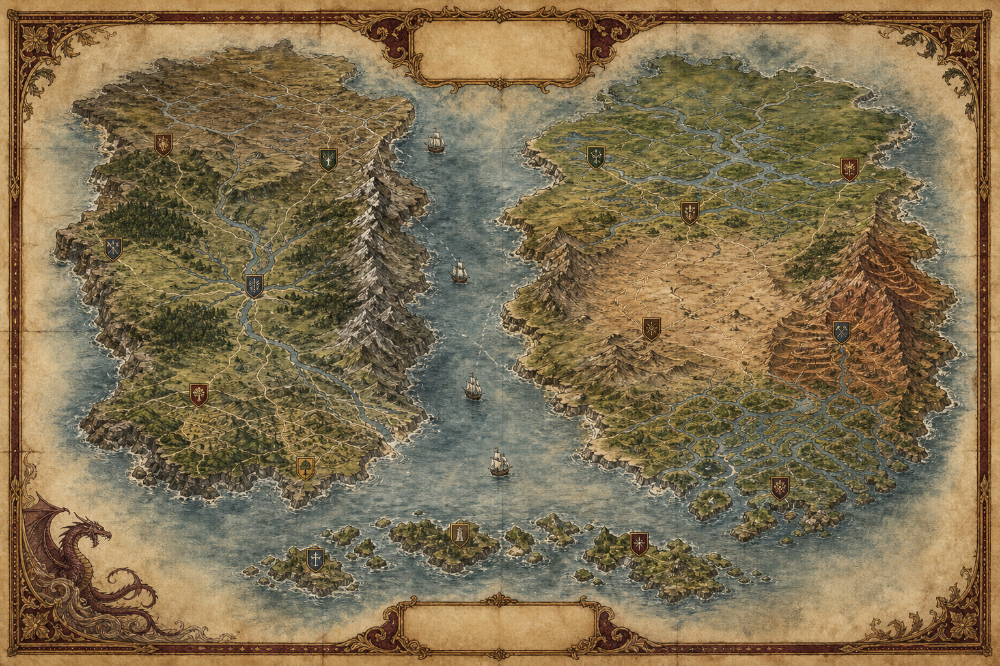
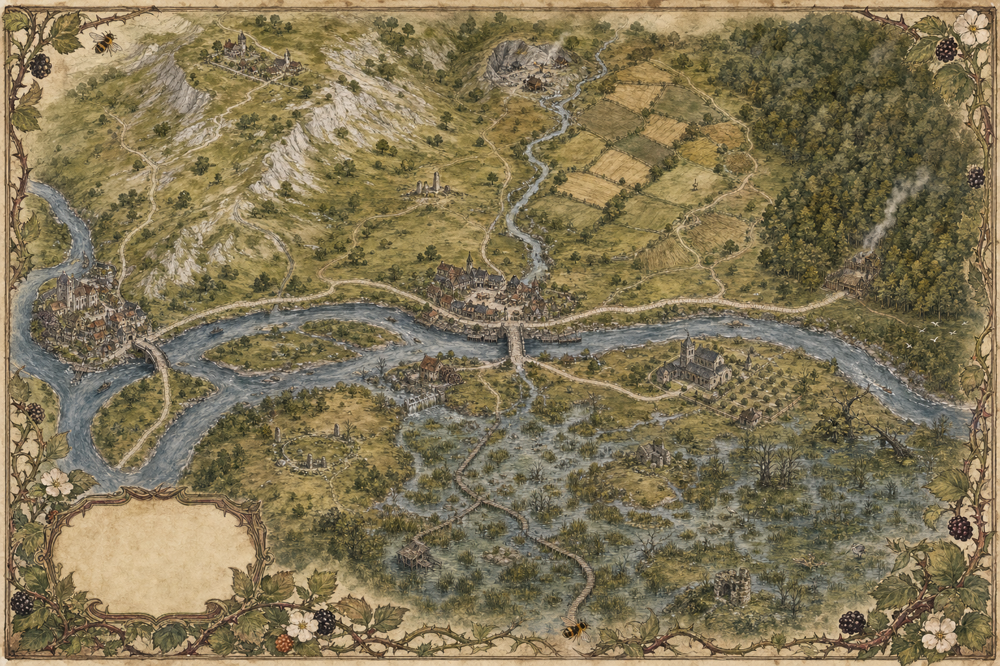
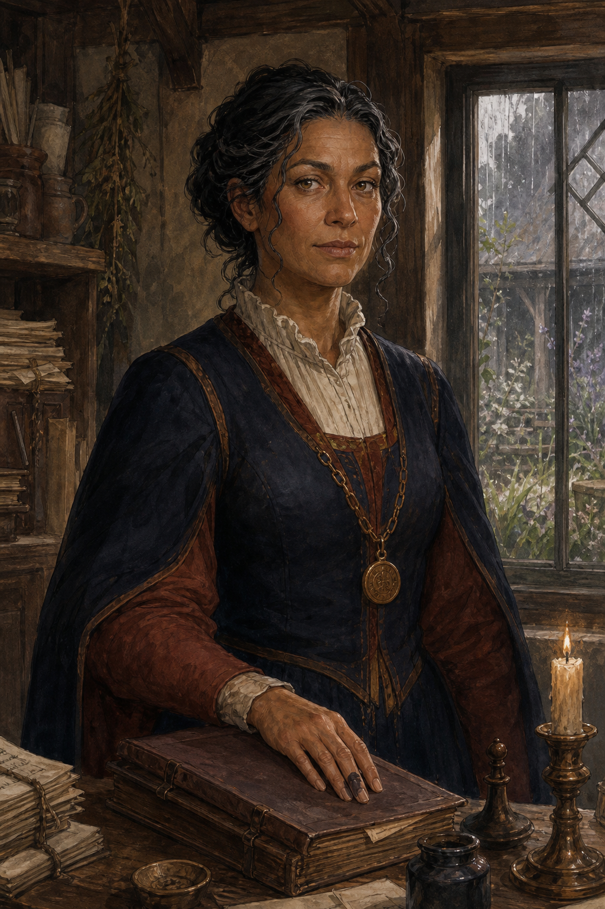
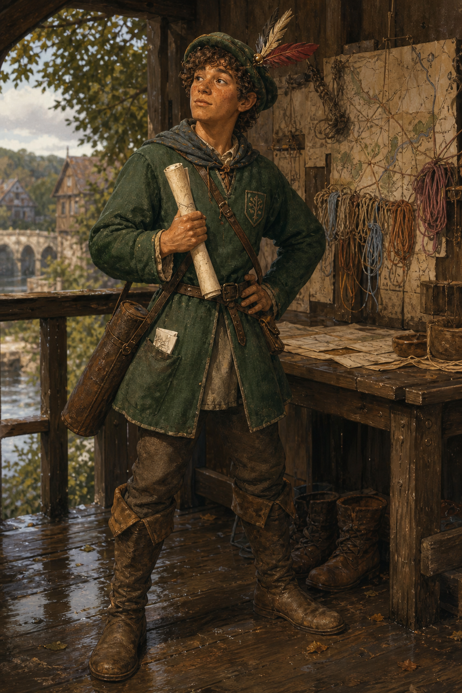
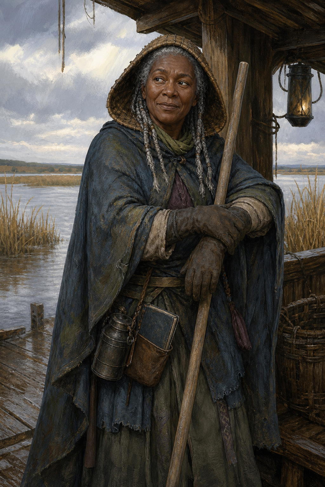
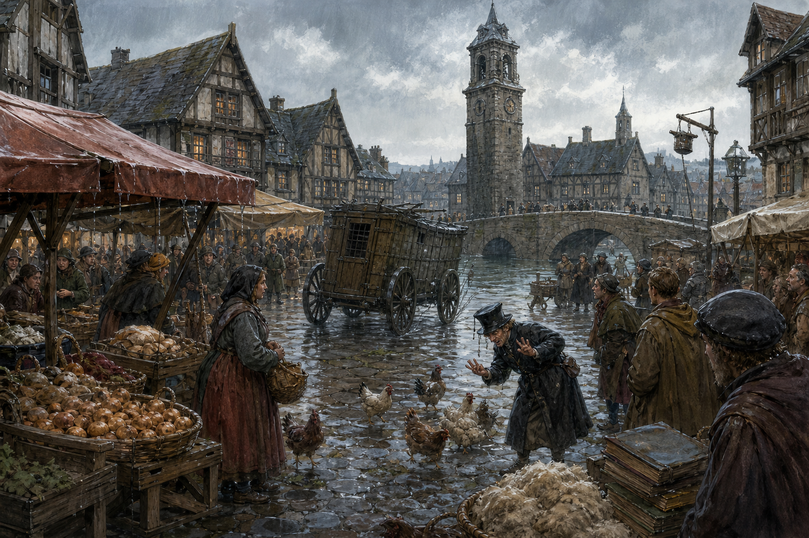
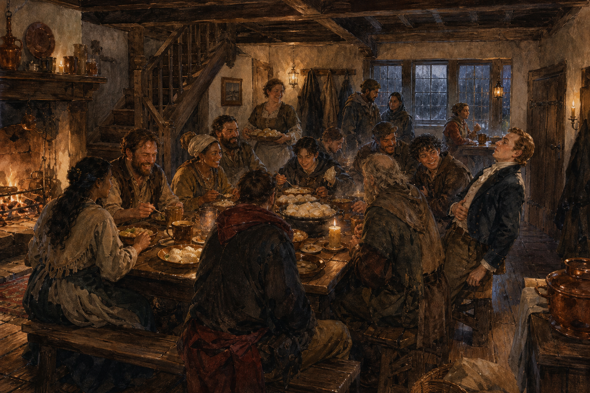
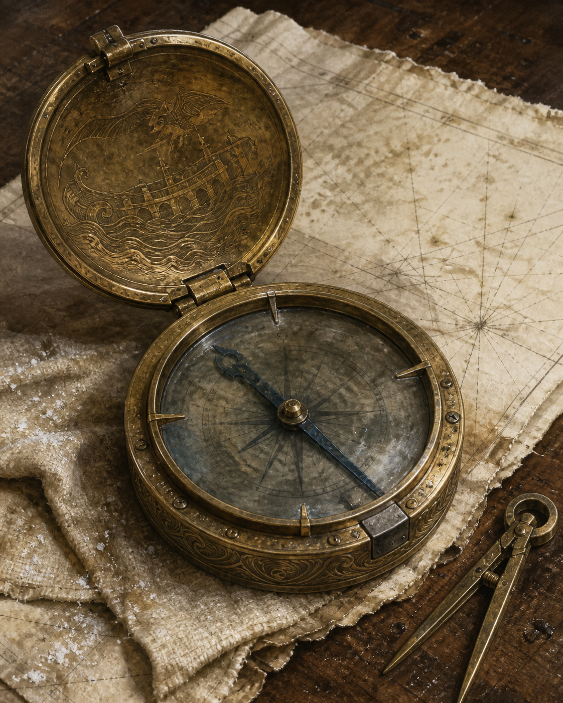
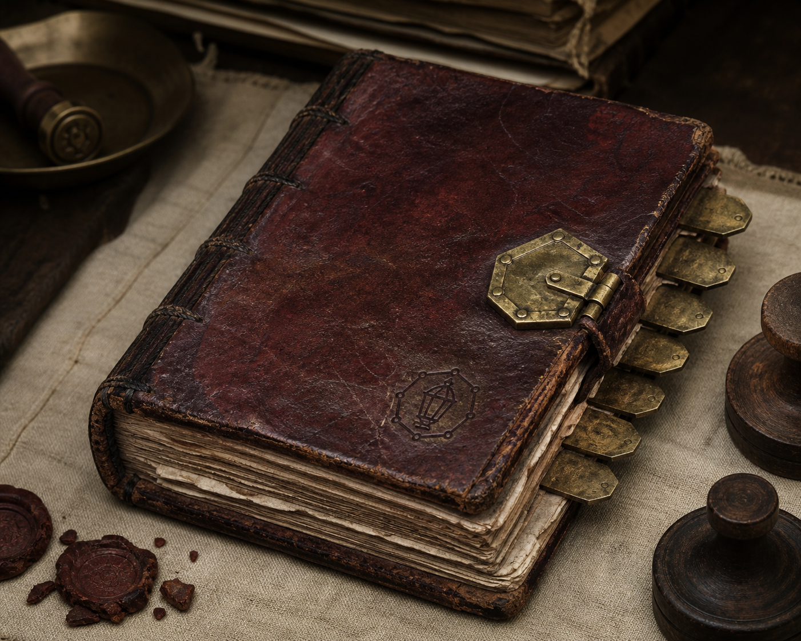

# Caldris visual pack

Status: **presentation-only concept art; not canonical state or registered media**
Generation mode: **built-in image generation tool**
Generated: 2026-08-30
Style owner: [Caldris creative charter](../CALDRIS-CREATIVE-CHARTER.md)

## Visual language

The shared visual language is watercolor and gouache storybook realism: grounded late-medieval
materials, lived-in architecture, expressive natural faces, restrained magic, warm earth colours,
rainy blue-greys, parchment, worn brass, oxblood leather, and moss. Images favour hospitality,
work, weather, repair, and historically layered objects over polished heroic spectacle.

Maps deliberately contain no generated text. Their coastlines, relative placement, roads, and
markers are illustrative and nonauthoritative. Repository containment, adjacency, routes, distances,
knowledge, and visibility remain the only future state owners.

## Atlas plates

### Caldris World atlas

Two continents face across the Lantern Sea. The plate captures Eredane's northern moors, central
river basin, western cliffs, southern green hills, and eastern mountains; Solasca's northern river
plain, central plateau, copper mountains, southern delta, and island chain; and twelve heraldic
centres without assigning exact coordinates.

### Alderwick and the Bramblebridge region

The first-campaign region shows the three-river capital at the western edge, chalk uplands, quarry
village, central Bramblebridge crossing, forest-gate road, abbey orchard, old mill, marsh, fen
boardwalks, and drowned groves.

## Character anchors

### Magistrate Elowen Pike

Strict, intelligent, humane, and capable of jokes so dry people occasionally file them as rulings.

### Tibb Fallow

An earnest junior watchman, overdramatic poet, and genuinely excellent map observer trying very hard
to look heroic.

### Nessa Quill

The relaxed ferrymaster and flood expert whose notebooks are far more meticulous than her manner
suggests.

## Location plates

### Bramblebridge market at the thirteenth bell

Rain, onions, wool, books, poultry classification, an empty tax wagon, and the bell tower that begins
the campaign.

### Supper at the Gilded Kettle

The campaign's first dependable hearth: shared food, wet cloaks, a crooked stair, an uneven bench,
and room for people to become familiar without becoming simple.

## Item plates

### The Bellglass Compass

Salt-worn brass and smoky bellglass, returned by Tavaros with the name of a ship not yet built. The
image establishes provenance and construction only; its D&D mechanics are deliberately undefined.

### A Seventh Ledger field book

An oxblood field ledger with repaired binding, seven margin tabs, and a seven-sided clasp: dangerous
because institutions obey it, not because it glows.

## Asset manifest

| File | Dimensions | Bytes | SHA-256 |
| --- | ---: | ---: | --- |
| `character-elowen-pike-v1.png` | 1024×1536 | 2,849,077 | `2591bc0e7766e2334952a4c8776ce4b1b91ee62398def6905fcac3b7d100e1b6` |
| `character-nessa-quill-v1.png` | 1024×1536 | 2,994,244 | `06cd5c68eaeaacabf143688128b007e41017b4f7df352b393e1b1a980fded9b8` |
| `character-tibb-fallow-v1.png` | 1024×1536 | 2,754,935 | `bdd9bf01217cea589dd2815d8dd80df726ef0b12cbb3552f05ee01ce92ec4d07` |
| `item-bellglass-compass-v1.png` | 1122×1402 | 2,935,844 | `cfa7ea2191b266fa81c555d4320ff6a4beed8fccbe3859365985e310391d12e0` |
| `item-seventh-ledger-v1.png` | 1402×1122 | 2,722,175 | `7f7c2b6875b37f3292e2fe55832c2b22438728e322ed2d9ab12a703f70049755` |
| `location-bramblebridge-market-v1.png` | 1536×1024 | 3,375,313 | `995917ca0016f16060cc0d0265185740835588edf0d60096a22d0eedcaafda6b` |
| `location-gilded-kettle-v1.png` | 1536×1024 | 3,033,009 | `ce611e8451c24ea7ef47791375f605b1e2974d970cedf9c25769742dc7d4428b` |
| `map-alderwick-bramblebridge-v1.png` | 1536×1024 | 3,987,069 | `45c36964ae0866e76233bcd2098a3154480a5915abc28af4757585b27633bc6a` |
| `map-caldris-world-v1.png` | 1536×1024 | 4,007,979 | `25acfef95de3ab25cf8a07b9cc8aec8d37333173f7006cab6572df71d5336cd0` |

## Final prompt set

The images were produced as nine distinct built-in generations. Each used the shared watercolor and
gouache storybook-realism language, original design, no logos/watermarks, no modern objects, no
readable generated labels, grounded materials, and restrained magic.

1. **World atlas:** two plausible continents across the Lantern Sea; Eredane's moors, river basin,
   cliffs, hills and mountain spine; Solasca's river plain, delta, plateau, copper mountains and
   islands; twelve heraldic centres; aged parchment; empty cartouches; no text.
2. **Alderwick regional atlas:** three-river capital, Highmead uplands, Dunwarren forest gate,
   Bramblebridge crossing, Candlefen marsh, Wren's Hollow quarry, Mallow Abbey, old mill, roads,
   drowned groves, bramble-and-bee border; no text.
3. **Elowen Pike:** middle-aged medium-brown-skinned magistrate with pinned dark-and-silver hair,
   navy/russet wool, modest seal chain, rainlit hearing room, closed ledger, precise and humane.
4. **Tibb Fallow:** freckled young watchman in green wool and an overdecorated feathered cap, map
   case and poem, trying an almost-convincing heroic stance inside his map-filled watch post.
5. **Nessa Quill:** older dark-skinned ferrymaster with salt-grey braids, reed rain hood, weathered
   blue-grey layers, ferry pole, tea flask and waterproof notebook beside the Candlefen marsh.
6. **Bramblebridge market:** rainy stone bridge and bell tower, timber market, onions, wool, books,
   chickens, empty tax wagon, and an overformal official counting poultry.
7. **Gilded Kettle:** warm communal supper, copper pots, dumplings, wet cloaks, rainlit windows,
   crooked stair, diverse workers and travellers, and gentle social humour.
8. **Bellglass Compass:** salt-worn brass compass with smoky crystal, dark blue needle, practical
   repairs, wave/bridge motifs, chart and divider, no glowing runes.
9. **Seventh Ledger:** repaired oxblood field book with seven-sided brass clasp, seven margin tabs,
   uneven pages, wax fragments and evidence cloth, historically burdened rather than demonic.

## Media boundary

These files are not registered media, live World facts, map coordinates, player-visible assets, or
identity bindings. Future use must pass the map/media owner, audience-safe projection, permanent ID,
provenance, and live synchronization gates. New variants must use versioned filenames rather than
overwriting this pack silently.

